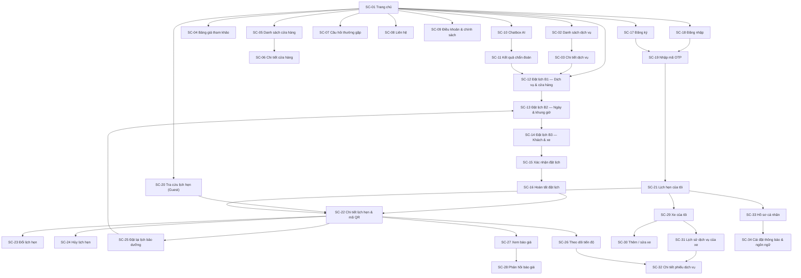
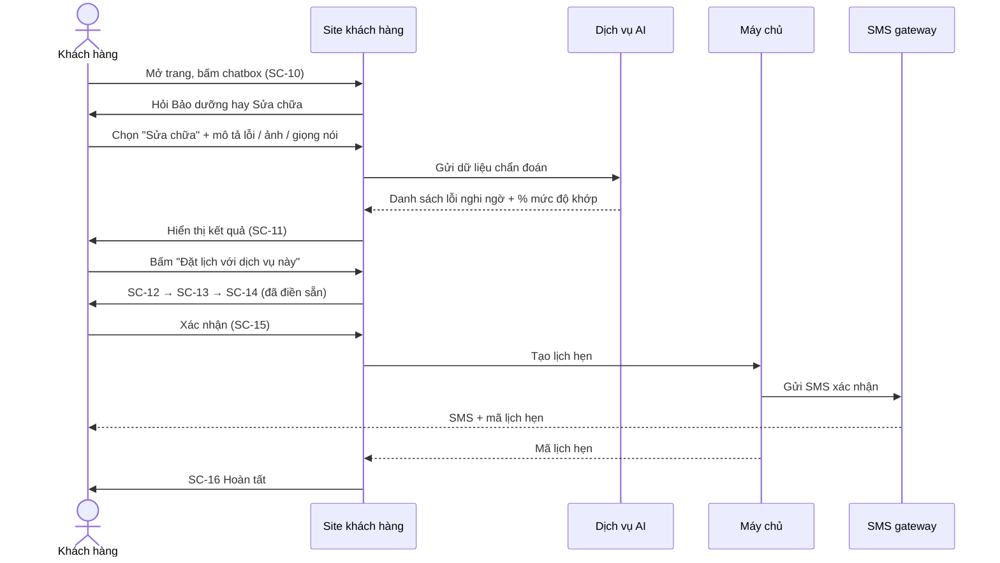
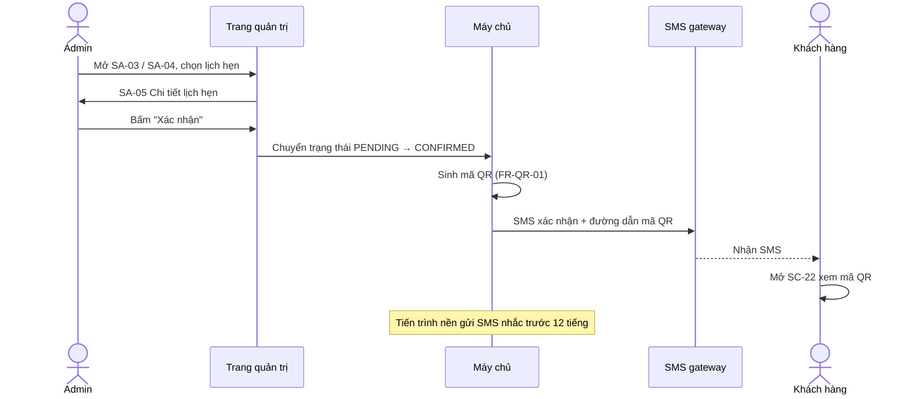
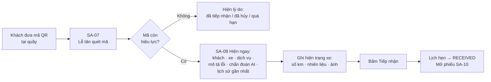
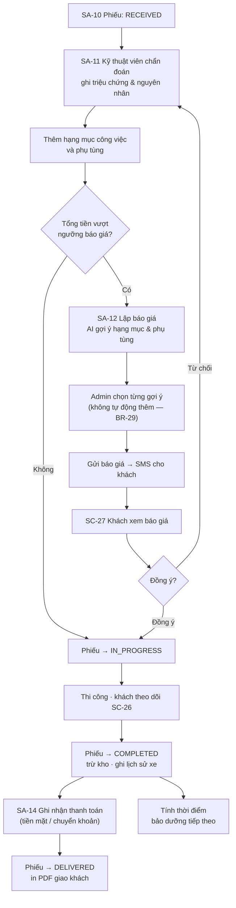
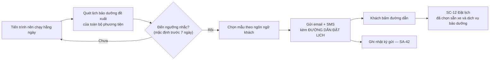
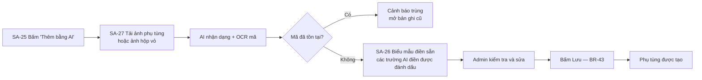

# 02 — Danh sách & sơ đồ màn hình

| | |
| --- | --- |
| **Mã tài liệu** | `SM-2026-001` |
| **Dự án** | Hệ thống quản lý dịch vụ bảo dưỡng & sửa chữa xe máy AOYAMA |
| **Phiên bản** | 1.0 |
| **Ngày** | 2026-09-14 |
| **Trạng thái** | Bản thảo |
| **Tài liệu liên quan** | [`OV-2026-001`](00-Tong-quan-du-an.md) · [`RD-2026-001`](01-Dinh-nghia-yeu-cau-du-an.md) · [`SS-2026-001`](03-Dac-ta-chi-tiet-man-hinh.md) |

---

## Mục lục

1. [Quy ước](#1-quy-ước)
2. [Tổng hợp số lượng màn hình](#2-tổng-hợp-số-lượng-màn-hình)
3. [Sơ đồ site — Site khách hàng](#3-sơ-đồ-site--site-khách-hàng)
4. [Danh sách màn hình — Site khách hàng](#4-danh-sách-màn-hình--site-khách-hàng)
5. [Sơ đồ site — Trang quản trị](#5-sơ-đồ-site--trang-quản-trị)
6. [Danh sách màn hình — Trang quản trị](#6-danh-sách-màn-hình--trang-quản-trị)
7. [Màn hình hệ thống](#7-màn-hình-hệ-thống)
8. [Sơ đồ luồng nghiệp vụ chính](#8-sơ-đồ-luồng-nghiệp-vụ-chính)
9. [Thành phần giao diện dùng chung](#9-thành-phần-giao-diện-dùng-chung)
10. [Ma trận màn hình × vai trò](#10-ma-trận-màn-hình--vai-trò)
11. [Quy ước điều hướng và bố cục](#11-quy-ước-điều-hướng-và-bố-cục)
12. [Đợt triển khai đề xuất](#12-đợt-triển-khai-đề-xuất)

---

## 1. Quy ước

### 1.1 Mã màn hình

| Tiền tố | Phạm vi |
| --- | --- |
| `SC-nn` | Màn hình **site khách hàng** (Screen — Customer) |
| `SA-nn` | Màn hình **trang quản trị** (Screen — Admin) |
| `SY-nn` | Màn hình **hệ thống** dùng chung cho cả hai site |

Mã màn hình **không đổi** sau khi đã phát hành. Khi bỏ một màn hình, mã của nó bị đánh dấu ngừng dùng chứ không cấp lại cho màn hình khác.

### 1.2 Loại màn hình

| Ký hiệu | Loại | Mô tả |
| --- | --- | --- |
| `L` | Danh sách | Bảng hoặc lưới dữ liệu, có lọc và phân trang |
| `D` | Chi tiết | Hiển thị một bản ghi |
| `F` | Biểu mẫu | Nhập hoặc sửa dữ liệu |
| `W` | Nhiều bước | Luồng chia thành các bước |
| `P` | Nội dung tĩnh | Trang giới thiệu, điều khoản |
| `X` | Đặc biệt | Bảng điều khiển, máy quét, chatbox, báo cáo |

### 1.3 Thiết bị đích

| Ký hiệu | Ý nghĩa |
| --- | --- |
| `PC+SP` | Thiết kế cho cả máy tính và điện thoại |
| `PC` | Ưu tiên máy tính, dùng được trên máy tính bảng |
| `SP` | Ưu tiên điện thoại |

### 1.4 Đợt triển khai

`MVP` · `G2` (Giai đoạn 2) · `G3` (Giai đoạn 3) — theo lộ trình tại [`OV-2026-001` §12](00-Tong-quan-du-an.md#12-lộ-trình-triển-khai-đề-xuất).

---

## 2. Tổng hợp số lượng màn hình

| Nhóm | Số màn hình | MVP | G2 | G3 |
| --- | ---: | ---: | ---: | ---: |
| Site khách hàng (`SC`) | 34 | 26 | 8 | 0 |
| Trang quản trị (`SA`) | 44 | 36 | 6 | 2 |
| Màn hình hệ thống (`SY`) | 5 | 5 | 0 | 0 |
| **Tổng** | **83** | **67** | **14** | **2** |

Ngoài ra có **26 thành phần giao diện dùng chung** (§9) được tái sử dụng trên nhiều màn hình.

---

## 3. Sơ đồ site — Site khách hàng



---

## 4. Danh sách màn hình — Site khách hàng

### 4.1 Nội dung công khai

| Mã | Tên màn hình | Loại | Đường dẫn | Vai trò | Thiết bị | Yêu cầu liên quan | Đợt |
| --- | --- | :---: | --- | --- | :---: | --- | :---: |
| `SC-01` | Trang chủ | `P` | `/` | Tất cả | PC+SP | `FR-PUB-01` | MVP |
| `SC-02` | Danh sách dịch vụ | `L` | `/services` | Tất cả | PC+SP | `FR-PUB-02` | MVP |
| `SC-03` | Chi tiết dịch vụ | `D` | `/services/:slug` | Tất cả | PC+SP | `FR-PUB-03` | MVP |
| `SC-04` | Bảng giá tham khảo | `L` | `/pricing` | Tất cả | PC+SP | `FR-PUB-04` `FR-SVC-06` | MVP |
| `SC-05` | Danh sách cửa hàng | `L` | `/stores` | Tất cả | PC+SP | `FR-PUB-05` | MVP |
| `SC-06` | Chi tiết cửa hàng | `D` | `/stores/:id` | Tất cả | PC+SP | `FR-PUB-05` `FR-STO-02` | MVP |
| `SC-07` | Câu hỏi thường gặp | `P` | `/faq` | Tất cả | PC+SP | `FR-PUB-06` | G2 |
| `SC-08` | Liên hệ | `F` | `/contact` | Tất cả | PC+SP | `FR-PUB-07` | G2 |
| `SC-09` | Điều khoản & chính sách dữ liệu | `P` | `/terms`, `/privacy` | Tất cả | PC+SP | `FR-PUB-08` `NFR-SE-11` | MVP |

### 4.2 Chatbox AI chẩn đoán

| Mã | Tên màn hình | Loại | Đường dẫn | Vai trò | Thiết bị | Yêu cầu liên quan | Đợt |
| --- | --- | :---: | --- | --- | :---: | --- | :---: |
| `SC-10` | Chatbox AI chẩn đoán | `X` | lớp phủ trên mọi trang | `R-GUEST` `R-USER` | PC+SP | `FR-AI-01`…`FR-AI-05` `FR-AI-11` | G2 |
| `SC-11` | Kết quả chẩn đoán AI | `D` | trong chatbox / `/diagnosis/:id` | `R-GUEST` `R-USER` | PC+SP | `FR-AI-06`…`FR-AI-10` | G2 |

### 4.3 Đặt lịch

| Mã | Tên màn hình | Loại | Đường dẫn | Vai trò | Thiết bị | Yêu cầu liên quan | Đợt |
| --- | --- | :---: | --- | --- | :---: | --- | :---: |
| `SC-12` | Đặt lịch — Bước 1: Chọn dịch vụ & cửa hàng | `W` | `/booking/step1` | `R-GUEST` `R-USER` | PC+SP | `FR-BOOK-02` `FR-BOOK-03` | MVP |
| `SC-13` | Đặt lịch — Bước 2: Chọn ngày & khung giờ | `W` | `/booking/step2` | `R-GUEST` `R-USER` | PC+SP | `FR-BOOK-04` `FR-BOOK-05` `BR-07` `BR-08` | MVP |
| `SC-14` | Đặt lịch — Bước 3: Thông tin khách & xe | `W` | `/booking/step3` | `R-GUEST` `R-USER` | PC+SP | `FR-BOOK-01` `FR-BOOK-06`…`FR-BOOK-08` | MVP |
| `SC-15` | Đặt lịch — Xác nhận | `W` | `/booking/confirm` | `R-GUEST` `R-USER` | PC+SP | `FR-BOOK-09` | MVP |
| `SC-16` | Đặt lịch — Hoàn tất | `W` | `/booking/done` | `R-GUEST` `R-USER` | PC+SP | `FR-BOOK-10` `FR-BOOK-11` | MVP |

### 4.4 Tài khoản

| Mã | Tên màn hình | Loại | Đường dẫn | Vai trò | Thiết bị | Yêu cầu liên quan | Đợt |
| --- | --- | :---: | --- | --- | :---: | --- | :---: |
| `SC-17` | Đăng ký | `F` | `/register` | `R-GUEST` | PC+SP | `FR-AUTH-01` | MVP |
| `SC-18` | Đăng nhập | `F` | `/login` | `R-GUEST` | PC+SP | `FR-AUTH-02` | MVP |
| `SC-19` | Nhập mã OTP | `F` | `/verify-otp` | `R-GUEST` | PC+SP | `FR-AUTH-03` `FR-AUTH-04` | MVP |
| `SC-33` | Hồ sơ cá nhân | `F` | `/account/profile` | `R-USER` | PC+SP | `FR-AUTH-06` `FR-AUTH-07` | MVP |
| `SC-34` | Cài đặt thông báo & ngôn ngữ | `F` | `/account/settings` | `R-USER` | PC+SP | `FR-I18N-03` `FR-NOT-14` | MVP |

### 4.5 Lịch hẹn của khách

| Mã | Tên màn hình | Loại | Đường dẫn | Vai trò | Thiết bị | Yêu cầu liên quan | Đợt |
| --- | --- | :---: | --- | --- | :---: | --- | :---: |
| `SC-20` | Tra cứu lịch hẹn (Guest) | `F` | `/booking/lookup` | `R-GUEST` | PC+SP | `FR-BOOK-15` | MVP |
| `SC-21` | Lịch hẹn của tôi | `L` | `/account/bookings` | `R-USER` | PC+SP | `FR-BOOK-16` | MVP |
| `SC-22` | Chi tiết lịch hẹn & mã QR | `D` | `/bookings/:code` | `R-GUEST` `R-USER` | PC+SP | `FR-QR-02` `FR-QR-03` | MVP |
| `SC-23` | Đổi lịch hẹn | `F` | `/bookings/:code/reschedule` | `R-GUEST` `R-USER` | PC+SP | `FR-BOOK-14` `BR-05` `BR-06` | MVP |
| `SC-24` | Hủy lịch hẹn | `F` | `/bookings/:code/cancel` | `R-GUEST` `R-USER` | PC+SP | `FR-BOOK-13` `BR-04` `BR-06` | MVP |
| `SC-25` | Đặt lại lịch bảo dưỡng | `F` | `/bookings/:code/rebook` | `R-USER` | PC+SP | `FR-BOOK-17` `FR-BOOK-18` `BR-11` | G2 |
| `SC-26` | Theo dõi tiến độ sửa chữa | `X` | `/bookings/:code/progress` | `R-GUEST` `R-USER` | PC+SP | `FR-WO-09` `FR-WO-10` | G2 |

### 4.6 Báo giá

| Mã | Tên màn hình | Loại | Đường dẫn | Vai trò | Thiết bị | Yêu cầu liên quan | Đợt |
| --- | --- | :---: | --- | --- | :---: | --- | :---: |
| `SC-27` | Xem báo giá | `D` | `/quotations/:token` | `R-GUEST` `R-USER` | PC+SP | `FR-QUO-07` `NFR-SE-08` | G2 |
| `SC-28` | Phản hồi báo giá | `F` | `/quotations/:token/respond` | `R-GUEST` `R-USER` | PC+SP | `FR-QUO-08` `FR-QUO-09` | G2 |

### 4.7 Phương tiện & lịch sử

| Mã | Tên màn hình | Loại | Đường dẫn | Vai trò | Thiết bị | Yêu cầu liên quan | Đợt |
| --- | --- | :---: | --- | --- | :---: | --- | :---: |
| `SC-29` | Xe của tôi | `L` | `/account/vehicles` | `R-USER` | PC+SP | `FR-VEH-01` `FR-VEH-07` | MVP |
| `SC-30` | Thêm / sửa xe | `F` | `/account/vehicles/:id/edit` | `R-USER` | PC+SP | `FR-VEH-01` `FR-VEH-02` | MVP |
| `SC-31` | Lịch sử dịch vụ của xe | `L` | `/account/vehicles/:id/history` | `R-USER` | PC+SP | `FR-VEH-04` `FR-VEH-05` | MVP |
| `SC-32` | Chi tiết phiếu dịch vụ (khách) | `D` | `/service-records/:id` | `R-USER` | PC+SP | `FR-VEH-06` `FR-PAY-06` | MVP |

---

## 5. Sơ đồ site — Trang quản trị

```mermaid
graph TD
    ALOGIN["SA-01 Đăng nhập quản trị"] --> DASH["SA-02 Bảng điều khiển"]

    DASH --> BK["Lịch hẹn"]
    BK --> BKL["SA-03 Danh sách lịch hẹn"]
    BK --> BKC["SA-04 Lịch theo ngày / tuần"]
    BKL --> BKD["SA-05 Chi tiết lịch hẹn"]
    BKC --> BKD
    BK --> BKN["SA-06 Tạo lịch hẹn thay khách"]

    DASH --> RCV["Tiếp nhận"]
    RCV --> SCAN["SA-07 Quét mã QR"]
    SCAN --> INTAKE["SA-08 Tiếp nhận xe"]
    BKD --> INTAKE

    DASH --> WO["Phiếu dịch vụ"]
    WO --> WOL["SA-09 Danh sách phiếu dịch vụ"]
    INTAKE --> WOD["SA-10 Chi tiết phiếu dịch vụ"]
    WOL --> WOD
    WOD --> WODG["SA-11 Chẩn đoán & hạng mục"]
    WOD --> QUOF["SA-12 Lập báo giá (AI gợi ý)"]
    WO --> QUOL["SA-13 Danh sách báo giá"]
    QUOL --> QUOF
    WOD --> PAY["SA-14 Ghi nhận thanh toán"]

    DASH --> CUS["Khách hàng"]
    CUS --> CUSL["SA-15 Danh sách khách hàng"]
    CUSL --> CUSD["SA-16 Chi tiết khách hàng"]
    CUSL --> CUSF["SA-17 Thêm / sửa khách hàng"]
    CUSL --> MERGE["SA-18 Gộp hồ sơ khách hàng"]
    CUSD --> VEHD

    DASH --> VEH["Phương tiện"]
    VEH --> VEHL["SA-19 Danh sách phương tiện"]
    VEHL --> VEHD["SA-20 Chi tiết phương tiện & lịch sử"]
    VEHL --> VEHF["SA-21 Thêm / sửa phương tiện"]

    DASH --> CAT["Danh mục"]
    CAT --> SVCL["SA-22 Danh sách dịch vụ"]
    SVCL --> SVCF["SA-23 Thêm / sửa dịch vụ"]
    CAT --> PRICE["SA-24 Quản lý bảng giá"]
    CAT --> PRTL["SA-25 Danh sách phụ tùng"]
    PRTL --> PRTF["SA-26 Thêm / sửa phụ tùng"]
    PRTF --> PRTAI["SA-27 Nhập liệu phụ tùng bằng AI"]
    CAT --> INV["SA-28 Tồn kho theo cửa hàng"]
    INV --> INVT["SA-29 Nhập / xuất / điều chỉnh kho"]

    DASH --> AI["Trợ lý AI"]
    AI --> TECH["SA-30 Trợ lý AI kỹ thuật"]
    AI --> KB["SA-31 Kho tài liệu kỹ thuật"]
    WOD --> TECH

    DASH --> STO["Cửa hàng"]
    STO --> STOL["SA-32 Danh sách cửa hàng"]
    STOL --> STOF["SA-33 Thêm / sửa cửa hàng"]
    STOF --> HOURS["SA-34 Giờ làm việc & ngày nghỉ"]
    STOF --> SLOT["SA-35 Khung giờ & năng lực tiếp nhận"]

    DASH --> RPT["Báo cáo"]
    RPT --> RPT1["SA-36 Báo cáo tổng hợp"]
    RPT --> RPT2["SA-37 Báo cáo doanh thu"]
    RPT --> RPT3["SA-38 Báo cáo phụ tùng & tồn kho"]

    DASH --> SYS["Hệ thống"]
    SYS --> USRL["SA-39 Tài khoản quản trị"]
    USRL --> USRF["SA-40 Thêm / sửa tài khoản"]
    SYS --> TPL["SA-41 Mẫu thông báo"]
    SYS --> NLOG["SA-42 Nhật ký gửi thông báo"]
    SYS --> CFG["SA-43 Cấu hình hệ thống"]
    SYS --> ALOG["SA-44 Nhật ký thao tác"]
```



---

## 6. Danh sách màn hình — Trang quản trị

### 6.1 Đăng nhập & bảng điều khiển

| Mã | Tên màn hình | Loại | Đường dẫn | Thiết bị | Yêu cầu liên quan | Đợt |
| --- | --- | :---: | --- | :---: | --- | :---: |
| `SA-01` | Đăng nhập quản trị | `F` | `/admin/login` | PC+SP | `FR-AUTH-09` `FR-AUTH-11` | MVP |
| `SA-02` | Bảng điều khiển | `X` | `/admin` | PC | `FR-RPT-11` | MVP |

### 6.2 Lịch hẹn

| Mã | Tên màn hình | Loại | Đường dẫn | Thiết bị | Yêu cầu liên quan | Đợt |
| --- | --- | :---: | --- | :---: | --- | :---: |
| `SA-03` | Danh sách lịch hẹn | `L` | `/admin/bookings` | PC | `FR-BOOK-20` | MVP |
| `SA-04` | Lịch hẹn dạng lịch (ngày / tuần) | `X` | `/admin/bookings/calendar` | PC | `FR-BOOK-21` `FR-STO-08` | MVP |
| `SA-05` | Chi tiết lịch hẹn | `D` | `/admin/bookings/:id` | PC | `FR-BOOK-22`…`FR-BOOK-26` `FR-AI-12` | MVP |
| `SA-06` | Tạo lịch hẹn thay khách | `F` | `/admin/bookings/new` | PC+SP | `FR-BOOK-19` `BR-12` | MVP |

### 6.3 Tiếp nhận xe

| Mã | Tên màn hình | Loại | Đường dẫn | Thiết bị | Yêu cầu liên quan | Đợt |
| --- | --- | :---: | --- | :---: | --- | :---: |
| `SA-07` | Quét mã QR | `X` | `/admin/scan` | SP | `FR-QR-05` `FR-QR-08` `BR-17` | MVP |
| `SA-08` | Tiếp nhận xe | `F` | `/admin/intake/:bookingId` | PC+SP | `FR-QR-06` `FR-QR-07` `FR-WO-01` `FR-WO-03` | MVP |

### 6.4 Phiếu dịch vụ & báo giá

| Mã | Tên màn hình | Loại | Đường dẫn | Thiết bị | Yêu cầu liên quan | Đợt |
| --- | --- | :---: | --- | :---: | --- | :---: |
| `SA-09` | Danh sách phiếu dịch vụ | `L` | `/admin/work-orders` | PC | `FR-WO-07` `FR-PAY-07` | MVP |
| `SA-10` | Chi tiết phiếu dịch vụ | `D` | `/admin/work-orders/:id` | PC | `FR-WO-02` `FR-WO-07`…`FR-WO-16` | MVP |
| `SA-11` | Chẩn đoán & hạng mục công việc | `F` | `/admin/work-orders/:id/items` | PC | `FR-WO-04` `FR-WO-05` `FR-WO-06` | MVP |
| `SA-12` | Lập báo giá (có AI gợi ý) | `F` | `/admin/work-orders/:id/quotation` | PC | `FR-QUO-01`…`FR-QUO-06` `FR-QUO-11` | G2 |
| `SA-13` | Danh sách báo giá | `L` | `/admin/quotations` | PC | `FR-QUO-10` `FR-QUO-12` | G2 |
| `SA-14` | Ghi nhận thanh toán | `F` | `/admin/work-orders/:id/payment` | PC+SP | `FR-PAY-02`…`FR-PAY-05` `FR-PAY-08` | MVP |

### 6.5 Khách hàng & phương tiện

| Mã | Tên màn hình | Loại | Đường dẫn | Thiết bị | Yêu cầu liên quan | Đợt |
| --- | --- | :---: | --- | :---: | --- | :---: |
| `SA-15` | Danh sách khách hàng | `L` | `/admin/customers` | PC | `FR-CUS-01` `FR-CUS-02` | MVP |
| `SA-16` | Chi tiết khách hàng | `D` | `/admin/customers/:id` | PC | `FR-CUS-03` `FR-CUS-05` | MVP |
| `SA-17` | Thêm / sửa khách hàng | `F` | `/admin/customers/:id/edit` | PC | `FR-CUS-04` `FR-CUS-08` | MVP |
| `SA-18` | Gộp hồ sơ khách hàng | `F` | `/admin/customers/merge` | PC | `FR-CUS-06` `FR-CUS-07` | G2 |
| `SA-19` | Danh sách phương tiện | `L` | `/admin/vehicles` | PC | `FR-VEH-08` `FR-VEH-09` | MVP |
| `SA-20` | Chi tiết phương tiện & lịch sử | `D` | `/admin/vehicles/:id` | PC | `FR-VEH-10` | MVP |
| `SA-21` | Thêm / sửa phương tiện | `F` | `/admin/vehicles/:id/edit` | PC | `FR-VEH-08` `FR-VEH-02` `FR-VEH-03` | MVP |

### 6.6 Dịch vụ, bảng giá, phụ tùng & tồn kho

| Mã | Tên màn hình | Loại | Đường dẫn | Thiết bị | Yêu cầu liên quan | Đợt |
| --- | --- | :---: | --- | :---: | --- | :---: |
| `SA-22` | Danh sách dịch vụ | `L` | `/admin/services` | PC | `FR-SVC-01` `FR-SVC-09` `FR-SVC-10` | MVP |
| `SA-23` | Thêm / sửa dịch vụ | `F` | `/admin/services/:id/edit` | PC | `FR-SVC-01`…`FR-SVC-03` `FR-SVC-07` `FR-I18N-04` | MVP |
| `SA-24` | Quản lý bảng giá | `F` | `/admin/pricing` | PC | `FR-SVC-04` `FR-SVC-05` `FR-SVC-06` `FR-SVC-08` | MVP |
| `SA-25` | Danh sách phụ tùng | `L` | `/admin/parts` | PC | `FR-PRT-08` `FR-PRT-14` | MVP |
| `SA-26` | Thêm / sửa phụ tùng | `F` | `/admin/parts/:id/edit` | PC | `FR-PRT-01`…`FR-PRT-03` | MVP |
| `SA-27` | Nhập liệu phụ tùng bằng AI | `X` | `/admin/parts/ai-import` | PC+SP | `FR-PRT-04`…`FR-PRT-07` `BR-43` | G2 |
| `SA-28` | Tồn kho theo cửa hàng | `L` | `/admin/inventory` | PC | `FR-PRT-09` `FR-PRT-12` | MVP |
| `SA-29` | Nhập / xuất / điều chỉnh kho | `F` | `/admin/inventory/transactions` | PC | `FR-PRT-11` `FR-PRT-13` `BR-42` | MVP |

### 6.7 Trợ lý AI kỹ thuật

| Mã | Tên màn hình | Loại | Đường dẫn | Thiết bị | Yêu cầu liên quan | Đợt |
| --- | --- | :---: | --- | :---: | --- | :---: |
| `SA-30` | Trợ lý AI kỹ thuật | `X` | `/admin/tech-assistant` | PC+SP | `FR-TEC-01`…`FR-TEC-04` `FR-TEC-06` `FR-TEC-07` | G3 |
| `SA-31` | Kho tài liệu kỹ thuật | `L` | `/admin/knowledge-base` | PC | `FR-TEC-05` | G3 |

### 6.8 Cửa hàng & lịch làm việc

| Mã | Tên màn hình | Loại | Đường dẫn | Thiết bị | Yêu cầu liên quan | Đợt |
| --- | --- | :---: | --- | :---: | --- | :---: |
| `SA-32` | Danh sách cửa hàng | `L` | `/admin/stores` | PC | `FR-STO-01` | MVP |
| `SA-33` | Thêm / sửa cửa hàng | `F` | `/admin/stores/:id/edit` | PC | `FR-STO-01` `FR-STO-02` `FR-I18N-04` | MVP |
| `SA-34` | Giờ làm việc & ngày nghỉ | `F` | `/admin/stores/:id/hours` | PC | `FR-STO-03` `FR-STO-04` | MVP |
| `SA-35` | Khung giờ & năng lực tiếp nhận | `F` | `/admin/stores/:id/slots` | PC | `FR-STO-05` `FR-STO-07` | MVP |

### 6.9 Báo cáo

| Mã | Tên màn hình | Loại | Đường dẫn | Thiết bị | Yêu cầu liên quan | Đợt |
| --- | --- | :---: | --- | :---: | --- | :---: |
| `SA-36` | Báo cáo tổng hợp | `X` | `/admin/reports` | PC | `FR-RPT-01`…`FR-RPT-06` `FR-RPT-12` | MVP |
| `SA-37` | Báo cáo doanh thu | `X` | `/admin/reports/revenue` | PC | `FR-RPT-06` `FR-RPT-08` `FR-RPT-09` `FR-RPT-10` | MVP |
| `SA-38` | Báo cáo phụ tùng & tồn kho | `X` | `/admin/reports/parts` | PC | `FR-RPT-07` `FR-PRT-12` | G2 |

### 6.10 Hệ thống

| Mã | Tên màn hình | Loại | Đường dẫn | Thiết bị | Yêu cầu liên quan | Đợt |
| --- | --- | :---: | --- | :---: | --- | :---: |
| `SA-39` | Tài khoản quản trị | `L` | `/admin/users` | PC | `FR-USR-01` `FR-USR-05` | MVP |
| `SA-40` | Thêm / sửa tài khoản quản trị | `F` | `/admin/users/:id/edit` | PC | `FR-USR-02` `FR-USR-03` `FR-USR-04` | MVP |
| `SA-41` | Mẫu thông báo | `F` | `/admin/notifications/templates` | PC | `FR-NOT-09` `FR-NOT-10` `FR-NOT-11` | MVP |
| `SA-42` | Nhật ký gửi thông báo | `L` | `/admin/notifications/logs` | PC | `FR-NOT-12` `FR-NOT-13` | MVP |
| `SA-43` | Cấu hình hệ thống | `F` | `/admin/settings` | PC | `FR-SYS-01` `FR-SYS-02` `FR-SYS-07` | G2 |
| `SA-44` | Nhật ký thao tác | `L` | `/admin/audit-logs` | PC | `FR-SYS-03`…`FR-SYS-06` | MVP |

---

## 7. Màn hình hệ thống

| Mã | Tên màn hình | Loại | Kích hoạt khi | Thiết bị | Đợt |
| --- | --- | :---: | --- | :---: | :---: |
| `SY-01` | Không tìm thấy trang (404) | `P` | Đường dẫn không tồn tại | PC+SP | MVP |
| `SY-02` | Không có quyền truy cập (403) | `P` | Vai trò không đủ quyền | PC+SP | MVP |
| `SY-03` | Lỗi hệ thống (500) | `P` | Lỗi không xử lý được ở máy chủ | PC+SP | MVP |
| `SY-04` | Đang bảo trì | `P` | Bật chế độ bảo trì | PC+SP | MVP |
| `SY-05` | Phiên đăng nhập hết hạn | `P` | Token hết hạn hoặc bị thu hồi | PC+SP | MVP |

---

## 8. Sơ đồ luồng nghiệp vụ chính

### 8.1 Luồng A — Khách đặt lịch (có chatbox AI)



### 8.2 Luồng B — Admin xác nhận và sinh mã QR



### 8.3 Luồng C — Tiếp nhận xe bằng mã QR



### 8.4 Luồng D — Từ chẩn đoán đến bàn giao



### 8.5 Luồng E — Nhắc bảo dưỡng định kỳ



### 8.6 Luồng F — Nhập liệu phụ tùng bằng AI



---

## 9. Thành phần giao diện dùng chung

| Mã | Thành phần | Dùng ở | Ghi chú |
| --- | --- | --- | --- |
| `CP-01` | Đầu trang site khách hàng | Toàn bộ `SC` | Logo, menu, nút chuyển ngôn ngữ, nút Đặt lịch, trạng thái đăng nhập |
| `CP-02` | Chân trang site khách hàng | Toàn bộ `SC` | Liên kết điều khoản, thông tin liên hệ, bản quyền |
| `CP-03` | Bộ chuyển ngôn ngữ | `CP-01`, `CP-04` | EN / VI / JA — `FR-I18N-02` |
| `CP-04` | Thanh điều hướng trang quản trị | Toàn bộ `SA` | Menu dọc theo nhóm module, thu gọn được |
| `CP-05` | Thanh tiêu đề trang quản trị | Toàn bộ `SA` | Tên màn hình, chọn cửa hàng, thông báo, tài khoản |
| `CP-06` | Bảng dữ liệu | Mọi màn `L` | Sắp xếp, phân trang, chọn nhiều dòng, chọn cột hiển thị |
| `CP-07` | Thanh lọc & tìm kiếm | Mọi màn `L` | Lọc theo khoảng ngày, trạng thái, cửa hàng, từ khóa |
| `CP-08` | Hộp thoại xác nhận | Mọi hành động không hoàn tác | `NFR-UX-08` |
| `CP-09` | Thông báo kết quả thao tác | Toàn hệ thống | Thành công / cảnh báo / lỗi, tự ẩn sau 5 giây |
| `CP-10` | Nhãn trạng thái | Lịch hẹn, phiếu dịch vụ, báo giá, thanh toán | Có màu **và** chữ — `NFR-UX-09` |
| `CP-11` | Bộ chọn ngày & khung giờ | `SC-13` `SC-23` `SA-06` | Ẩn ngày nghỉ, hiện số chỗ còn lại |
| `CP-12` | Thẻ dịch vụ | `SC-02` `SC-03` `SC-12` | Tên, mô tả ngắn, giá tham khảo, thời gian ước tính |
| `CP-13` | Biểu mẫu thông tin xe | `SC-14` `SC-30` `SA-21` | Hãng, dòng, loại, nhiên liệu, biển số, số km |
| `CP-14` | Ô tải ảnh | `SC-10` `SA-08` `SA-27` | Kéo thả, xem trước, giới hạn dung lượng và loại tệp |
| `CP-15` | Nút ghi âm | `SC-10` | Ghi tối đa 120 giây, nghe lại, ghi lại |
| `CP-16` | Thẻ kết quả AI | `SC-11` `SA-12` `SA-27` | Luôn kèm nhãn "Gợi ý bởi AI" và độ tin cậy |
| `CP-17` | Hiển thị mã QR | `SC-22` | Kèm mã lịch hẹn dạng chữ để nhập tay dự phòng |
| `CP-18` | Máy quét mã QR | `SA-07` | Dùng camera, có ô nhập tay dự phòng |
| `CP-19` | Thanh tiến độ trạng thái | `SC-26` `SA-10` | Hiển thị các mốc của phiếu dịch vụ |
| `CP-20` | Bộ chọn phụ tùng | `SA-11` `SA-12` `SA-29` | Tìm theo mã/tên, hiện tồn kho của cửa hàng |
| `CP-21` | Bảng dòng tiền | `SA-11` `SA-12` `SC-27` | Tiền công, tiền phụ tùng, thuế, tổng cộng |
| `CP-22` | Thẻ chỉ số | `SA-02` `SA-36`…`SA-38` | Con số lớn, nhãn, so sánh kỳ trước |
| `CP-23` | Nút xuất tệp | `SA-36`…`SA-38` | Excel và PDF — `FR-RPT-09` `FR-RPT-10` |
| `CP-24` | Ô nhập đa ngôn ngữ | `SA-23` `SA-26` `SA-33` `SA-41` | Ba tab EN / VI / JA — `FR-I18N-04` |
| `CP-25` | Bảng nhật ký thay đổi | `SA-05` `SA-10` `SA-44` | Thời điểm, người thực hiện, hành động, giá trị trước/sau |
| `CP-26` | Trạng thái rỗng | Mọi màn `L` | Giải thích và gợi ý hành động tiếp theo |

---

## 10. Ma trận màn hình × vai trò

| Màn hình | `R-GUEST` | `R-USER` | `R-ADMIN` |
| --- | :---: | :---: | :---: |
| `SC-01`…`SC-09` Nội dung công khai | ✔ | ✔ | ✔ |
| `SC-10` `SC-11` Chatbox AI & kết quả | ✔ | ✔ | — |
| `SC-12`…`SC-16` Luồng đặt lịch | ✔ | ✔ | — |
| `SC-17`…`SC-19` Đăng ký / đăng nhập / OTP | ✔ | — | — |
| `SC-20` Tra cứu lịch hẹn | ✔ | ✔ | — |
| `SC-21` Lịch hẹn của tôi | — | ✔ | — |
| `SC-22`…`SC-24` Chi tiết / đổi / hủy lịch hẹn | ✔¹ | ✔ | — |
| `SC-25` Đặt lại lịch bảo dưỡng | — | ✔ | — |
| `SC-26` Theo dõi tiến độ | ✔¹ | ✔ | — |
| `SC-27` `SC-28` Báo giá | ✔² | ✔ | — |
| `SC-29`…`SC-32` Xe & lịch sử | — | ✔ | — |
| `SC-33` `SC-34` Hồ sơ & cài đặt | — | ✔ | — |
| `SA-01`…`SA-44` Toàn bộ trang quản trị | — | — | ✔ |
| `SY-01`…`SY-05` Màn hình hệ thống | ✔ | ✔ | ✔ |

¹ Truy cập qua mã lịch hẹn + số điện thoại. ² Truy cập qua đường dẫn có mã bảo mật.

---

## 11. Quy ước điều hướng và bố cục

### 11.1 Site khách hàng

```
┌──────────────────────────────────────────────────────┐
│ CP-01  Logo │ Dịch vụ  Bảng giá  Cửa hàng │ 🌐 │ [Đặt lịch] │
├──────────────────────────────────────────────────────┤
│                                                      │
│                   Nội dung trang                     │
│                                                      │
├──────────────────────────────────────────────────────┤
│ CP-02  Liên hệ · Điều khoản · Chính sách dữ liệu     │
└──────────────────────────────────────────────────────┘
                                          ┌──────────┐
                                          │ 💬 SC-10 │ ← chatbox nổi
                                          └──────────┘
```

| Quy ước | Nội dung |
| --- | --- |
| Nút chính | Nút **Đặt lịch** luôn hiện ở đầu trang trên mọi màn hình `SC` |
| Điện thoại | Menu thu vào nút ba gạch; nút Đặt lịch cố định ở đáy màn hình |
| Đường dẫn phân cấp | Hiện từ cấp thứ hai trở đi |
| Một hành động chính | Mỗi màn chỉ có một nút chính nổi bật — `NFR-UX-06` |
| Số bước | Luồng đặt lịch tối đa 3 bước, có chỉ báo tiến trình — `NFR-UX-05` |

### 11.2 Trang quản trị

```
┌────────────┬─────────────────────────────────────────┐
│            │ CP-05  Tên màn hình │ Cửa hàng ▾ │ 🔔 │👤│
│  CP-04     ├─────────────────────────────────────────┤
│  Bảng ĐK   │                                         │
│  Lịch hẹn  │           Nội dung màn hình             │
│  Tiếp nhận │                                         │
│  Phiếu DV  │                                         │
│  Khách hàng│                                         │
│  Danh mục  │                                         │
│  Trợ lý AI │                                         │
│  Cửa hàng  │                                         │
│  Báo cáo   │                                         │
│  Hệ thống  │                                         │
└────────────┴─────────────────────────────────────────┘
```

| Quy ước | Nội dung |
| --- | --- |
| Menu | Menu dọc bên trái, nhóm theo module, thu gọn được |
| Chọn cửa hàng | Bộ chọn cửa hàng trên thanh tiêu đề áp dụng cho mọi màn danh sách |
| Danh sách → chi tiết | Bấm vào dòng mở màn chi tiết; sửa mở biểu mẫu riêng |
| Thao tác nhanh | `SA-07` Quét mã QR có nút tắt cố định vì dùng thường xuyên tại quầy |
| Xác nhận | Mọi thao tác xóa, hủy, hoàn tất đều qua `CP-08` |

### 11.3 Quy ước hiển thị kết quả AI

| # | Quy ước |
| --- | --- |
| 1 | Mọi nội dung do AI sinh ra đặt trong `CP-16`, nền khác biệt với dữ liệu do người nhập |
| 2 | Luôn kèm nhãn **"Gợi ý bởi AI"** |
| 3 | Hiển thị **mức độ khớp (%)** khi mô hình trả về giá trị này |
| 4 | Với `SA-12` và `SA-27`, phải có nút **Áp dụng** riêng cho từng mục — không tự động ghi vào biểu mẫu |
| 5 | Trường do AI điền sẵn được đánh dấu bằng biểu tượng cho tới khi người dùng chạm vào |
| 6 | Khi AI không phản hồi hoặc quá thời gian chờ, hiện thông báo và lối đi thủ công thay thế |
| 7 | Câu trả lời của `SA-30` luôn kèm trích dẫn nguồn; không có nguồn thì trả lời "không có dữ liệu" |

---

## 12. Đợt triển khai đề xuất

| Đợt | Mục tiêu | Màn hình |
| --- | --- | --- |
| **Đợt 1** — Nền tảng | Chạy được luồng đặt lịch cơ bản | `SC-01`…`SC-06` `SC-09` `SC-12`…`SC-22` `SA-01`…`SA-06` `SY-01`…`SY-05` |
| **Đợt 2** — Vận hành xưởng | Tiếp nhận bằng QR và xử lý phiếu dịch vụ | `SC-23` `SC-24` `SA-07`…`SA-11` `SA-14` |
| **Đợt 3** — Dữ liệu chủ | Danh mục, khách hàng, tồn kho | `SC-29`…`SC-34` `SA-15`…`SA-17` `SA-19`…`SA-26` `SA-28` `SA-29` `SA-32`…`SA-35` `SA-39`…`SA-42` |
| **Đợt 4** — Báo cáo | Thống kê và xuất tệp | `SA-36` `SA-37` `SA-44` |
| **Đợt 5** — AI & nâng cao | Chatbox, báo giá, theo dõi tiến độ, nhập liệu AI | `SC-07` `SC-08` `SC-10` `SC-11` `SC-25`…`SC-28` `SA-12` `SA-13` `SA-18` `SA-27` `SA-38` `SA-43` |
| **Đợt 6** — Trợ lý kỹ thuật | Kho tri thức và trợ lý AI | `SA-30` `SA-31` |

---

## Lịch sử phiên bản

| Phiên bản | Ngày | Người sửa | Thay đổi |
| --- | --- | --- | --- |
| 1.0 | 2026-09-14 | Đội tài liệu | Bản đầu tiên — 83 màn hình, 26 thành phần dùng chung, 2 sơ đồ site, 6 sơ đồ luồng nghiệp vụ |
