# Tài liệu thiết kế cơ bản
## Hệ thống quản lý dịch vụ bảo dưỡng & sửa chữa xe máy AOYAMA

| Hạng mục | Nội dung |
| --- | --- |
| Mã tài liệu | BD-2026-001 |
| Phiên bản | 1.1 (Draft) |
| Ngày lập | 2026-08-25 |
| Khách hàng | Mobility Enshu Railway Co., Ltd. — https://mobility.entetsu.co.jp/ |
| Đối tượng dịch vụ | Chuỗi cửa hàng xe máy AOYAMA — https://www.aoyama-shoukai.co.jp/ |
| Tài liệu nguồn | `docs/Requirement-Definition/Dinh-nghia-yeu-cau-du-an.md` (RD-2026-001 v1.17), `docs/Requirements/Thu thập yêu cầu ban đầu.docx`, `docs/Requirements/Proposal.pptx` |
| Trạng thái | Chờ rà soát nội bộ |

---

## Mục lục

| Chương | Nội dung |
| --- | --- |
| 1 | Giới thiệu |
| 2 | Kiến trúc hệ thống |
| 3 | Thiết kế màn hình |
| 4 | Thiết kế luồng nghiệp vụ |
| 5 | Thiết kế dữ liệu |
| 6 | Thiết kế API |
| 7 | Thiết kế xác thực & phân quyền |
| 8 | Thiết kế thông báo |
| 9 | Thiết kế xử lý theo lô (batch) |
| 10 | Thiết kế tích hợp AI |
| 11 | Thiết kế đa ngôn ngữ |
| 12 | Thiết kế xử lý lỗi & nhật ký |
| 13 | Thiết kế đáp ứng yêu cầu phi chức năng |
| 14 | Quyết định thiết kế |
| 15 | Truy vết yêu cầu → thiết kế |
| 16 | Điểm tồn đọng ảnh hưởng thiết kế |
| 17 | Lịch sử phiên bản |

---

## 1. Giới thiệu

### 1.1 Mục đích tài liệu

Tài liệu này chuyển **175 yêu cầu chức năng** và **35 yêu cầu phi chức năng** trong `RD-2026-001` thành **thiết kế cơ bản** — kiến trúc, màn hình, dữ liệu, API, luồng nghiệp vụ và quy tắc xử lý — làm đầu vào cho giai đoạn thiết kế chi tiết và lập trình.

Tài liệu này trả lời câu hỏi **"làm thế nào"**, còn `RD-2026-001` trả lời câu hỏi **"làm cái gì"**.

### 1.2 Phạm vi tài liệu

| | Có trong tài liệu này | Không có trong tài liệu này |
| --- | --- | --- |
| Kiến trúc | Sơ đồ thành phần, công nghệ, mô hình triển khai | Cấu hình hạ tầng chi tiết, IaC |
| Màn hình | Danh sách màn hình, sơ đồ chuyển màn hình, thành phần chính | Wireframe, thiết kế đồ họa, mockup chi tiết |
| Dữ liệu | ERD, danh sách bảng, cột chính, ràng buộc, danh mục mã | Script DDL, chỉ mục tối ưu, kế hoạch phân vùng |
| API | Danh sách endpoint, phương thức, tham số chính, mã lỗi | OpenAPI schema đầy đủ, ví dụ payload từng trường |
| Nghiệp vụ | Sơ đồ tuần tự các luồng chính, quy tắc xử lý | Mã giả từng hàm, kịch bản kiểm thử đơn vị |

> **Lưu ý quan trọng:** `RD-2026-001` hiện ở trạng thái **Chờ khách hàng xác nhận** và còn **29 điểm cần làm rõ** (`OQ`). Các phần thiết kế phụ thuộc vào những điểm này được đánh dấu ⚠ và tổng hợp tại **chương 16**.

### 1.3 Quan hệ giữa các tài liệu

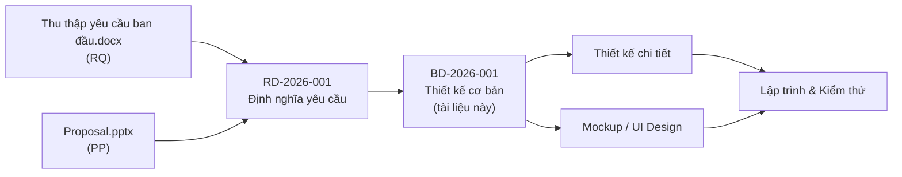

### 1.4 Quy ước mã hiệu

| Tiền tố | Ý nghĩa | Ví dụ |
| --- | --- | --- |
| `SCR-C-xx` | Màn hình **site khách hàng** | `SCR-C-13` |
| `SCR-A-xx` | Màn hình **site quản trị (CMS)** | `SCR-A-08` |
| `TBL-xx` | Bảng dữ liệu | `TBL-08` |
| `API-xxx` | Nhóm API | `API-BKG` |
| `SEQ-xx` | Luồng nghiệp vụ (sơ đồ tuần tự) | `SEQ-03` |
| `BAT-xx` | Tiến trình chạy theo lịch | `BAT-01` |
| `MSG-xx` | Mẫu thông báo email/SMS | `MSG-04` |
| `ERR-xx` | Mã lỗi nghiệp vụ | `ERR-BKG-03` |
| `TKD-xx` | Quyết định thiết kế (ghi tại chương 14) | `TKD-05` |
| `FR-` `BR-` `NFR-` `DEC-` `OQ-` `AC-` | Tham chiếu sang `RD-2026-001` | `FR-BKG-16` |

Mọi mã bắt đầu bằng `FR-`, `BR-`, `NFR-`, `DEC-`, `OQ-`, `AC-` đều **trỏ sang tài liệu định nghĩa yêu cầu**, không định nghĩa lại ở đây.

---

## 2. Kiến trúc hệ thống

### 2.1 Sơ đồ tổng thể

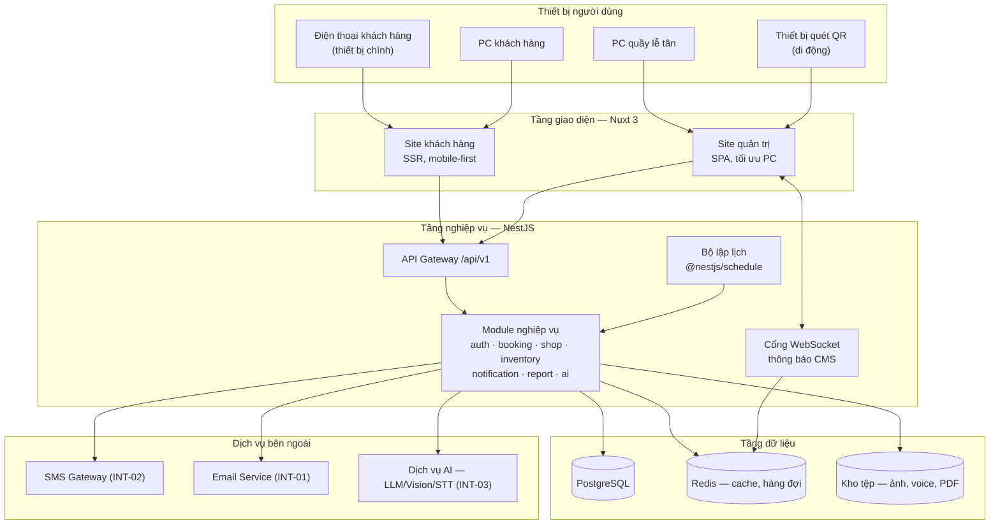

### 2.2 Công nghệ sử dụng

| Tầng | Công nghệ | Căn cứ |
| --- | --- | --- |
| Giao diện | **Nuxt 3 + TypeScript** | Chuẩn team — `README` repo `-fe` |
| Nghiệp vụ | **NestJS + TypeScript + TypeORM** | Chuẩn team — `README` repo `-be` |
| Cơ sở dữ liệu | **PostgreSQL 16** | `TKD-03` ⚠ chưa có yêu cầu chỉ định, cần chốt |
| Bộ nhớ đệm / hàng đợi | **Redis 7** — phiên WebSocket, hàng đợi gửi SMS/email, khóa chống chạy trùng batch | `TKD-04` |
| Kho tệp | **Kho đối tượng tương thích S3** — ảnh chatbox, voice, ảnh phụ tùng, PDF hóa đơn | `TKD-05` |
| Đa ngôn ngữ | `@nuxtjs/i18n` (giao diện) + `nestjs-i18n` (email/SMS) | `NFR-I18N-01`, `NFR-I18N-04` |
| Thời gian thực | **Socket.IO** qua `@nestjs/websockets` | `FR-NTF-16` ⚠ `OQ-23` |
| Lập lịch | `@nestjs/schedule`, múi giờ `Asia/Tokyo` | `BR-10`, `BR-25` |
| Xuất tệp | `pdfmake` (hóa đơn PDF), `exceljs` (báo cáo Excel) | `FR-PAY-03`, `FR-RPT-04` |
| Mã QR | `qrcode` (sinh), `@zxing/browser` (quét bằng camera) | `FR-QRC-01`, `FR-QRC-03` |

### 2.3 Phân rã module phía nghiệp vụ

Kiến trúc **monolith có mô-đun** (modular monolith): một tiến trình NestJS duy nhất, chia thành các module độc lập theo miền nghiệp vụ. Lựa chọn này phù hợp quy mô một chuỗi cửa hàng và vẫn cho phép tách microservice về sau (`NFR-PRF-05`).

| Module | Trách nhiệm | FR chính |
| --- | --- | --- |
| `auth` | Đăng ký, đăng nhập, JWT, refresh token, quên mật khẩu, OTP | `FR-AUT-01`…`09` |
| `customer` | Hồ sơ khách hàng, nhận diện theo số điện thoại, gom dữ liệu Guest | `FR-BKG-15`, `FR-VEH-06` |
| `vehicle` | Danh sách xe, lịch sử bảo dưỡng theo xe | `FR-VEH-01`…`06` |
| `catalog` | Dịch vụ, phụ tùng, bảng giá toàn chuỗi | `FR-SRV-01`…`07`, `FR-PRT-01`…`04` |
| `shop` | Cửa hàng, giờ làm việc, ngày nghỉ, năng lực khung giờ, cô lập dữ liệu | `FR-SHP-01`…`05`, `28`…`42` |
| `booking` | Vòng đời booking, hủy, đổi lịch, đặt lịch lặp lại, cờ chờ phụ tùng | `FR-BKG-01`…`35` |
| `qrcode` | Sinh mã QR, tra cứu khi quét, chuyển trạng thái idempotent | `FR-QRC-01`…`12` |
| `repair` | Báo giá, tiến độ sửa chữa, ghi lịch sử bảo dưỡng | `FR-RPR-01`…`04` |
| `inventory` | Tồn kho theo cửa hàng, điều phối phụ tùng, nhật ký biến động | `FR-SHP-12`…`27` |
| `payment` | Trạng thái thanh toán, hóa đơn PDF | `FR-PAY-01`…`04` |
| `notification` | Thông báo CMS, hàng đợi email/SMS, mẫu đa ngôn ngữ | `FR-NTF-01`…`26` |
| `report` | Thống kê, export Excel/PDF, báo cáo cửa hàng và toàn chuỗi | `FR-RPT-01`…`07` |
| `ai` | Chatbox, nhận diện ảnh phụ tùng, voice-to-text, gợi ý báo giá, tra cứu kỹ thuật | `FR-AI-01`…`10` |
| `admin` | Quản lý người dùng, phân quyền, cấu hình hệ thống | `FR-ADM-01`…`07` |

### 2.4 Cấu trúc mã nguồn phía giao diện

Repo `evn-ict-challenges-2026-fe` chứa **hai ứng dụng Nuxt tách biệt** dùng chung một lớp nền (`TKD-01`):

```
evn-ict-challenges-2026-fe/
├── apps/
│   ├── customer/          # Site khách hàng — SSR, mobile-first (DEC-27)
│   └── cms/               # Site quản trị — SPA, tối ưu PC (DEC-26)
├── layers/
│   ├── shared-ui/         # Component dùng chung, design token
│   ├── shared-api/        # Client gọi API sinh từ OpenAPI, kiểu dữ liệu
│   └── shared-i18n/       # Chuỗi ngôn ngữ dùng chung (en/vi/ja)
└── nuxt.config.ts
```

Cách chia này đáp ứng đồng thời:

- `NFR-PLT-04` — hai site tách biệt, dùng chung tầng nghiệp vụ.
- `NFR-PLT-05` — CMS ở tên miền riêng, Guest không truy cập được.
- `NFR-PLT-06`, `NFR-PLT-07` — hai site có chiến lược render và điểm ngắt responsive khác nhau: site khách hàng dựng cho SP trước, CMS dựng cho PC trước.

**Chiến lược render:**

| Site / trang | Chế độ | Lý do |
| --- | --- | --- |
| Site khách hàng | **SSR** (universal) | Trang giới thiệu dịch vụ và danh sách cửa hàng cần được công cụ tìm kiếm thu thập; tải lần đầu nhanh trên mạng di động (`NFR-PRF-01`) |
| Trang tra cứu bằng token | **SSR nhưng gắn `noindex`** | `NFR-SEC-09` — không được lập chỉ mục |
| Site quản trị | **SPA** (`ssr: false`) | Sau đăng nhập không cần SEO; thao tác liên tục tại quầy, chuyển màn hình tức thời |

### 2.5 Mô hình triển khai

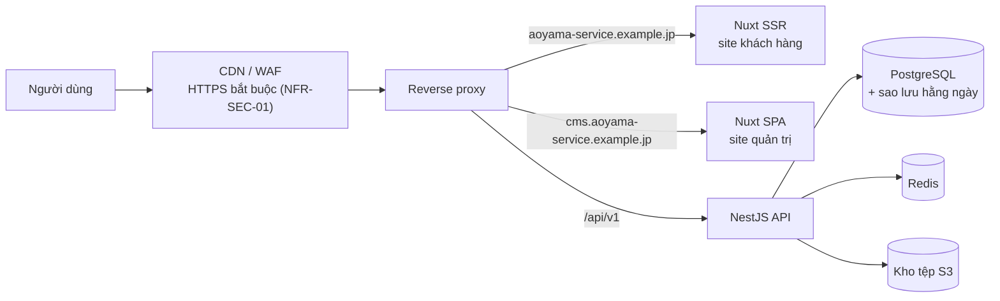

| Môi trường | Mục đích |
| --- | --- |
| `local` | Máy lập trình viên, Docker Compose |
| `dev` | Tích hợp liên tục từ nhánh `develop` |
| `staging` | Khách hàng nghiệm thu theo `AC-01`…`AC-35` |
| `production` | Vận hành thật |

**Tách tên miền giữa hai site** (`TKD-02`) thay vì dùng chung một tên miền và phân biệt bằng đường dẫn: cookie phiên của CMS khi đó không bao giờ được gửi kèm trong yêu cầu phát sinh từ site khách hàng, giảm bề mặt tấn công và thỏa `NFR-PLT-05` một cách triệt để.

---

## 3. Thiết kế màn hình

### 3.1 Sitemap — site khách hàng

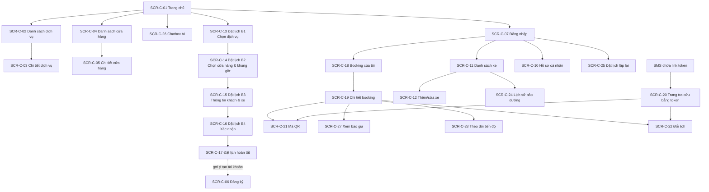

### 3.2 Sitemap — site quản trị (CMS)

```mermaid
flowchart TD
    LG["SCR-A-01 Đăng nhập CMS"] --> DASH["SCR-A-02 Dashboard"]
    DASH --> BLIST["SCR-A-03 Danh sách booking"]
    BLIST --> BDET["SCR-A-04 Chi tiết booking"]
    BDET --> BQUO["SCR-A-11 Lập báo giá"]
    BDET --> BPRG["SCR-A-12 Cập nhật tiến độ sửa chữa"]
    BDET --> BPAY["SCR-A-13 Thanh toán"]
    BDET --> BINV["SCR-A-14 Hóa đơn"]
    BDET --> BCAN["SCR-A-07 Hủy booking + lý do"]
    BDET --> BMOV["SCR-A-06 Đổi lịch / chuyển cửa hàng"]
    BLIST --> BNEW["SCR-A-05 Tạo booking thay khách"]
    DASH --> SCAN["SCR-A-08 Quét QR"]
    SCAN --> RECV["SCR-A-09 Màn hình tiếp nhận xe"]
    SCAN --> MFIND["SCR-A-10 Tra cứu booking thủ công"]
    DASH --> NOTI["SCR-A-15 Danh sách thông báo"]
    DASH --> INV["SCR-A-19 Tồn kho cửa hàng"]
    INV --> INVQ["SCR-A-20 Tra cứu tồn kho toàn chuỗi"]
    INVQ --> TRQ["SCR-A-21 Tạo yêu cầu điều phối"]
    DASH --> TRL["SCR-A-22 Danh sách yêu cầu điều phối"]
    TRL --> TRD["SCR-A-23 Chi tiết & duyệt/từ chối"]
    DASH --> AIT["SCR-A-31 Trợ lý AI kỹ thuật viên"]
    DASH --> MST["Quản trị"]
    MST --> M1["SCR-A-16 Quản lý dịch vụ"]
    MST --> M2["SCR-A-17 Quản lý phụ tùng"]
    M2 --> M2A["SCR-A-18 Nhập phụ tùng bằng AI"]
    MST --> M3["SCR-A-24 Quản lý cửa hàng"]
    M3 --> M3A["SCR-A-25 Giờ làm việc & ngày nghỉ"]
    M3 --> M3B["SCR-A-26 Năng lực khung giờ"]
    MST --> M4["SCR-A-27 Bảng tải theo khung giờ"]
    MST --> M5["SCR-A-28 Quản lý khách hàng"]
    MST --> M6["SCR-A-29 Người dùng & phân quyền"]
    MST --> M7["SCR-A-32 Danh mục lý do hủy"]
    DASH --> RPT["SCR-A-30 Báo cáo & thống kê"]
```

### 3.3 Danh sách màn hình — site khách hàng

| Mã | Tên màn hình | Vai trò truy cập | Thành phần chính | FR liên quan |
| --- | --- | --- | --- | --- |
| SCR-C-01 | Trang chủ | Guest, User | Giới thiệu dịch vụ, nút Đặt lịch nổi bật, chuyển ngôn ngữ | `FR-AUT-03`, `NFR-I18N-02` |
| SCR-C-02 | Danh sách dịch vụ & bảng giá | Guest, User | Thẻ dịch vụ bảo dưỡng / sửa chữa, giá tham khảo | `FR-SRV-01`, `FR-SRV-05` |
| SCR-C-03 | Chi tiết dịch vụ | Guest, User | Mô tả, hạng mục, giá theo nhiên liệu / mức độ lỗi | `FR-SRV-02`, `FR-SRV-03` |
| SCR-C-04 | Danh sách cửa hàng | Guest, User | Tên, địa chỉ, giờ mở cửa, số điện thoại | `FR-SHP-05` |
| SCR-C-05 | Chi tiết cửa hàng | Guest, User | Bản đồ, giờ làm việc theo ngày, ngày nghỉ | `FR-SHP-05`, `FR-SHP-28` |
| SCR-C-06 | Đăng ký tài khoản | Guest | Form SĐT/email + mật khẩu | `FR-AUT-01` |
| SCR-C-07 | Đăng nhập | Guest | Đăng nhập bằng email **hoặc** SĐT | `FR-AUT-02` |
| SCR-C-08 | Quên mật khẩu | Guest | Nhập SĐT/email, gửi link đặt lại | `FR-AUT-08` |
| SCR-C-09 | Đặt lại mật khẩu | Guest | Nhập mật khẩu mới theo token | `FR-AUT-08` |
| SCR-C-10 | Hồ sơ cá nhân | User | Tên, email, SĐT, ngôn ngữ hiển thị | `FR-AUT-09` |
| SCR-C-11 | Danh sách xe | User | Thẻ xe, nút thêm xe | `FR-VEH-01`, `NFR-UX-08` |
| SCR-C-12 | Thêm / sửa xe | User | Loại xe, hãng, model, biển số, nhiên liệu, năm SX | `FR-VEH-02` |
| SCR-C-13 | Đặt lịch B1 — chọn dịch vụ | Guest, User | Chọn Bảo dưỡng / Sửa chữa / cả hai | `FR-BKG-01` |
| SCR-C-14 | Đặt lịch B2 — cửa hàng & khung giờ | Guest, User | Chọn cửa hàng, lịch chỉ hiện khung giờ còn chỗ | `FR-SHP-03`, `FR-SHP-31`, `FR-BKG-35` |
| SCR-C-15 | Đặt lịch B3 — thông tin khách & xe | Guest, User | Tên + SĐT bắt buộc, email tùy chọn; Guest nhập xe trực tiếp | `FR-AUT-04`, `FR-VEH-05` |
| SCR-C-16 | Đặt lịch B4 — xác nhận | Guest, User | Tóm tắt trước khi gửi | `NFR-UX-03` |
| SCR-C-17 | Đặt lịch hoàn tất | Guest, User | Mã booking, thông báo đã gửi SMS, gợi ý tạo tài khoản | `FR-BKG-04`, `FR-AUT-06` |
| SCR-C-18 | Booking của tôi | User | Danh sách dạng thẻ, lọc theo trạng thái | `FR-BKG-08` |
| SCR-C-19 | Chi tiết booking | User | Trạng thái, dịch vụ, xe, cửa hàng, nút hủy/đổi lịch | `FR-BKG-08`, `FR-BKG-18`, `FR-BKG-05a` |
| SCR-C-20 | Tra cứu bằng link token | Guest | Bản rút gọn của SCR-C-19, che bớt thông tin cá nhân | `FR-BKG-13`, `NFR-SEC-10` |
| SCR-C-21 | Mã QR | User, Guest | QR toàn màn hình, độ sáng tối đa; nếu chưa xác nhận thì hiện lời nhắn chờ | `FR-QRC-02`, `FR-QRC-10` |
| SCR-C-22 | Đổi lịch | User, Guest | Chọn khung giờ mới trong cùng cửa hàng | `FR-BKG-06` |
| SCR-C-23 | Hủy booking | User, Guest | Hộp thoại xác nhận | `FR-BKG-05` |
| SCR-C-24 | Lịch sử bảo dưỡng theo xe | User | Dòng thời gian các lần dịch vụ | `FR-BKG-10`, `FR-RPR-04` |
| SCR-C-25 | Đặt lịch lặp lại | User | Chu kỳ, ngày bắt đầu; chỉ với dịch vụ Bảo dưỡng | `FR-BKG-07`, `FR-BKG-14`, `BR-04` |
| SCR-C-26 | Chatbox AI | Guest, User | Nút chọn nhanh, nhập text, tải ảnh, ghi âm | `FR-AI-01`…`05` |
| SCR-C-27 | Xem báo giá | User, Guest | Hạng mục, phụ tùng, thành tiền | `FR-RPR-02` |
| SCR-C-28 | Theo dõi tiến độ sửa chữa | User | Thanh tiến trình theo trạng thái | `FR-BKG-09`, `FR-RPR-03` |

### 3.4 Danh sách màn hình — site quản trị (CMS)

| Mã | Tên màn hình | Vai trò | Thành phần chính | FR liên quan |
| --- | --- | --- | --- | --- |
| SCR-A-01 | Đăng nhập CMS | Staff, Admin | Form đăng nhập riêng, không dùng chung với khách | `NFR-PLT-05` |
| SCR-A-02 | Dashboard | Staff, Admin | Booking hôm nay, chờ xác nhận, quá hạn, cảnh báo tồn kho | `FR-BKG-21` |
| SCR-A-03 | Danh sách booking | Staff ⬤, Admin | Bộ lọc trạng thái / **Quá hạn** / **Chờ phụ tùng** / cửa hàng | `FR-BKG-11`, `FR-BKG-21`, `24`, `29` |
| SCR-A-04 | Chi tiết booking | Staff ⬤, Admin | Toàn bộ thông tin, lịch sử trạng thái, ghi chú nội bộ, cờ chờ phụ tùng | `FR-BKG-26`, `FR-BKG-27`, `FR-BKG-34` |
| SCR-A-05 | Tạo booking thay khách | Staff ⬤, Admin | Như luồng khách nhưng bỏ qua giới hạn năng lực kèm cảnh báo | `FR-BKG-03`, `FR-SHP-33` |
| SCR-A-06 | Đổi lịch / chuyển cửa hàng | Staff ⬤, Admin | Chọn ngày giờ mới hoặc cửa hàng đích, xem tải cửa hàng khác | `FR-BKG-31`, `FR-SHP-06`, `FR-SHP-10` |
| SCR-A-07 | Hủy booking | Staff ⬤, Admin | **Bắt buộc chọn lý do hủy** từ danh mục | `FR-BKG-19`, `FR-BKG-23` |
| SCR-A-08 | Quét QR | Staff ⬤, Admin | Truy cập camera, dùng được trên di động | `FR-QRC-03`, `NFR-PLT-06` |
| SCR-A-09 | Tiếp nhận xe | Staff ⬤, Admin | Thông tin khách, xe, dịch vụ, mô tả lỗi, lịch sử; xác nhận trạng thái mới | `FR-QRC-04`, `FR-QRC-06`, `FR-QRC-07` |
| SCR-A-10 | Tra cứu booking thủ công | Staff ⬤, Admin | Tìm theo SĐT hoặc tên khách khi chưa có QR | `FR-QRC-11` |
| SCR-A-11 | Lập báo giá | Staff ⬤, Admin | Hạng mục kiểm tra, phụ tùng, chi phí; nút gợi ý AI | `FR-RPR-01`, `FR-AI-06` |
| SCR-A-12 | Cập nhật tiến độ sửa chữa | Staff ⬤, Admin | Chuyển trạng thái thủ công, ghi kết quả vào lịch sử xe | `FR-BKG-17`, `FR-RPR-03`, `FR-RPR-04` |
| SCR-A-13 | Thanh toán | Staff ⬤, Admin | Đánh dấu đã thanh toán, hình thức chuyển khoản / tiền mặt | `FR-PAY-01`, `FR-PAY-02`, `DEC-28` |
| SCR-A-14 | Hóa đơn | Staff ⬤, Admin | Xuất PDF theo ngày, in, có thông tin công ty | `FR-PAY-03`, `FR-PAY-04` |
| SCR-A-15 | Danh sách thông báo | Staff ⬤, Admin | Mới nhất trước, phân biệt đã/chưa đọc, lọc theo loại | `FR-NTF-12`, `FR-NTF-15`, `FR-NTF-17` |
| SCR-A-16 | Quản lý dịch vụ | Admin | Thêm/sửa/xóa, giá dùng chung toàn chuỗi | `FR-SRV-04`, `FR-SRV-06` |
| SCR-A-17 | Quản lý phụ tùng | Admin | Thêm/sửa/xóa, giá phụ tùng | `FR-PRT-01`, `FR-PRT-02` |
| SCR-A-18 | Nhập phụ tùng bằng AI | Admin | Tải ảnh phụ tùng/vỏ hộp, xem lại và sửa trước khi lưu | `FR-PRT-03`, `FR-PRT-04`, `FR-AI-08` |
| SCR-A-19 | Tồn kho cửa hàng | Staff ⬤, Admin | Số lượng, ngưỡng tối thiểu, cảnh báo | `FR-SHP-12`, `FR-SHP-19` |
| SCR-A-20 | Tra cứu tồn kho toàn chuỗi | Staff, Admin | **Chỉ hiện số lượng** của cửa hàng khác | `FR-SHP-13`, `FR-SHP-37` |
| SCR-A-21 | Tạo yêu cầu điều phối | Staff ⬤, Admin | Chọn cửa hàng nguồn, phụ tùng, số lượng, booking liên quan | `FR-SHP-14` |
| SCR-A-22 | Danh sách yêu cầu điều phối | Staff ⬤, Admin | Hai tab: **gửi đi** / **nhận về** | `FR-SHP-15` |
| SCR-A-23 | Chi tiết & duyệt yêu cầu | Staff ⬤, Admin | Đồng ý + ấn định ngày bàn giao, hoặc từ chối + lý do | `FR-SHP-21`, `FR-SHP-22` |
| SCR-A-24 | Quản lý cửa hàng | Admin | Tên, địa chỉ, SĐT | `FR-SHP-01`, `FR-ADM-07` |
| SCR-A-25 | Giờ làm việc & ngày nghỉ | Admin | Cấu hình theo từng ngày trong tuần, ngày nghỉ đột xuất | `FR-SHP-28`, `FR-SHP-30` |
| SCR-A-26 | Năng lực khung giờ | Admin | Số booking tối đa mỗi khung giờ, theo cửa hàng | `FR-SHP-29` |
| SCR-A-27 | Bảng tải theo khung giờ | Staff ⬤, Admin | Đã nhận / tối đa; nút **đánh dấu quá tải thủ công** | `FR-SHP-32`, `FR-SHP-42` |
| SCR-A-28 | Quản lý khách hàng | Staff ⬤, Admin | Hồ sơ theo SĐT, lịch sử dịch vụ | `FR-ADM-06`, `FR-BKG-15` |
| SCR-A-29 | Người dùng & phân quyền | Admin | Tài khoản Staff, gắn cửa hàng, vai trò | `FR-ADM-05`, `FR-SHP-02` |
| SCR-A-30 | Báo cáo & thống kê | **Chỉ Admin** | Theo ngày/tháng/loại xe/cửa hàng/lý do hủy, export | `FR-RPT-01`…`07`, `DEC-28` |
| SCR-A-31 | Trợ lý AI kỹ thuật viên | Staff, Admin | Hỏi đáp quy trình sửa chữa, mã lỗi, thông số | `FR-AI-07` ⚠ `OQ-11` |
| SCR-A-32 | Danh mục lý do hủy | Admin | Quản lý danh mục, có mục "Khách không đến" | `FR-BKG-23` ⚠ `OQ-28` |

**Ghi chú:** ⬤ nghĩa là Staff có quyền **nhưng chỉ trong phạm vi cửa hàng mình** (`BR-42`, `BR-47`). Việc lọc theo cửa hàng được áp đặt ở phía máy chủ (`FR-SHP-36`), không phải chỉ ẩn trên giao diện.

### 3.5 Nguyên tắc bố cục theo thiết bị

| Site | Điểm ngắt gốc | Điểm ngắt mở rộng | Nguyên tắc |
| --- | --- | --- | --- |
| Site khách hàng | **375 px** (SP) | 768 px, 1024 px | Một cột, không cuộn ngang, thẻ thay bảng (`NFR-UX-05`, `NFR-UX-08`, `AC-35`) |
| Site quản trị | **1280 px** (PC) | 768 px cho màn hình quét QR | Bảng nhiều cột, thao tác bằng chuột và bàn phím |

Quy tắc bắt buộc trên site khách hàng:

- Vùng bấm tối thiểu **44 × 44 px**, nút chính đặt trong tầm ngón cái (`NFR-UX-06`).
- Trường số điện thoại dùng `inputmode="tel"`, ngày giờ dùng bộ chọn thay vì gõ tay (`NFR-UX-07`).
- Luồng đặt lịch tối đa **4 bước** — đúng bằng `SCR-C-13` → `SCR-C-16` (`NFR-UX-03`).
- Toàn bộ luồng khách hoàn tất được trên SP, **không có chức năng nào chỉ chạy trên PC** (`NFR-PLT-08`, `AC-34`).

---

## 4. Thiết kế luồng nghiệp vụ

Chương này mô tả các luồng có nhiều bên tham gia hoặc có quy tắc chuyển trạng thái. Các thao tác CRUD đơn giản không mô tả ở đây.

| Mã | Luồng | Bên tham gia |
| --- | --- | --- |
| SEQ-01 | Guest đặt lịch | Khách · Site khách hàng · API · SMS · CMS |
| SEQ-02 | Nhân viên xác nhận booking và sinh mã QR | Nhân viên · API · Khách |
| SEQ-03 | Tiếp nhận xe bằng quét QR | Lễ tân · API |
| SEQ-04 | Khách hủy / đổi lịch | Khách · API · CMS |
| SEQ-05 | Điều phối phụ tùng giữa hai cửa hàng | Cửa hàng nhận · Cửa hàng nguồn · API |
| SEQ-06 | Chuyển booking sang cửa hàng khác | Nhân viên · API · Khách |
| SEQ-07 | Rà soát booking quá hạn lúc 16:00 | Bộ lập lịch · API · CMS · SMS |
| SEQ-08 | Báo giá, hoàn tất dịch vụ và thanh toán | Nhân viên · API · Khách |

### SEQ-01 — Guest đặt lịch

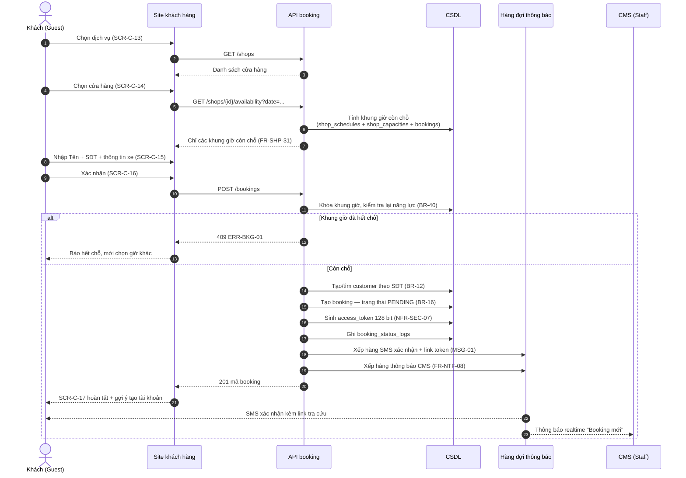

**Quy tắc áp dụng:** `BR-11` (Tên + SĐT là tối thiểu), `BR-12` (SĐT là khóa nhận diện), `BR-13` (truy cập qua link token), `BR-16` (khởi tạo ở *Chờ xác nhận*), `BR-20` (thao tác của khách sinh thông báo CMS).

**Điểm cần lưu ý khi lập trình:** bước kiểm tra năng lực phải nằm **trong cùng giao dịch** với bước tạo booking và dùng khóa ở mức khung giờ. Nếu chỉ kiểm tra ở bước hiển thị lịch (`GET /availability`), hai khách đặt đồng thời vào khung giờ cuối cùng sẽ cùng thành công và vượt mức cấu hình `FR-SHP-29`.

### SEQ-02 — Xác nhận booking và sinh mã QR

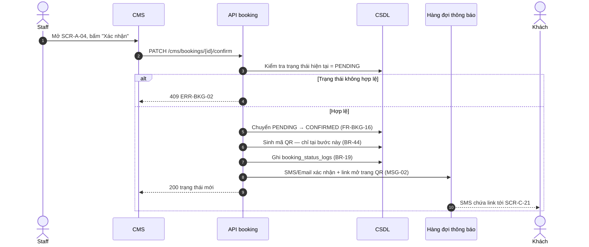

**Vì sao QR sinh ở bước này chứ không lúc đặt lịch:** `DEC-21` — điểm này **khác với `RQ §7`** của tài liệu nguồn. Booking ở *Chờ xác nhận* chưa chắc được cửa hàng nhận, nên phát QR sớm sẽ khiến khách mang xe đến với một lịch hẹn chưa được xác nhận. `FR-QRC-10` quy định trang tra cứu hiển thị lời nhắn chờ thay cho mã QR.

### SEQ-03 — Tiếp nhận xe bằng quét QR

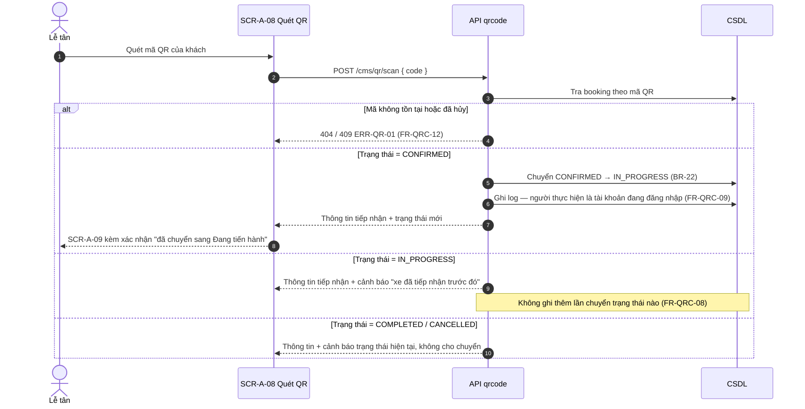

**Tính idempotent** (`FR-QRC-08`): thao tác quét được thực hiện qua một câu lệnh cập nhật có điều kiện trạng thái (`UPDATE ... WHERE status = 'CONFIRMED'`), rồi căn cứ số dòng bị ảnh hưởng để quyết định có ghi log hay không. Quét lại nhiều lần không sinh thêm bản ghi lịch sử.

**Trường hợp khách chưa có QR** (`FR-QRC-11`): lễ tân chuyển sang `SCR-A-10`, tra theo số điện thoại hoặc tên, xác nhận booking rồi tiếp tục — luồng khi đó là `SEQ-02` rồi `SEQ-03`.

### SEQ-04 — Khách hủy hoặc đổi lịch

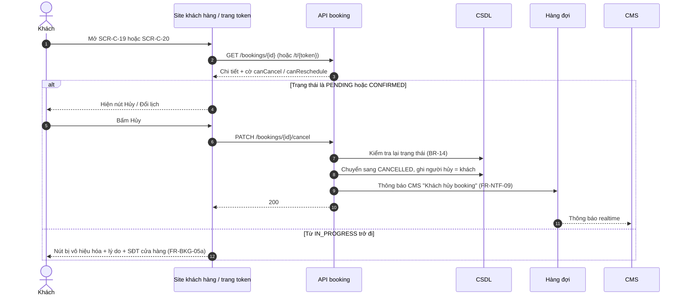

**Ràng buộc là trạng thái, không phải thời gian** (`BR-02`): hệ thống không áp bất kỳ giới hạn "trước N giờ" nào, và không thu phí phạt (`BR-03`). Ranh giới duy nhất nằm giữa trạng thái *Xác nhận* và *Đang tiến hành*.

**Kiểm tra hai lần:** giao diện ẩn nút dựa trên cờ trả về, nhưng API vẫn phải kiểm tra lại trạng thái trước khi ghi. Cờ trên giao diện có thể đã cũ nếu nhân viên vừa quét QR.

### SEQ-05 — Điều phối phụ tùng giữa hai cửa hàng

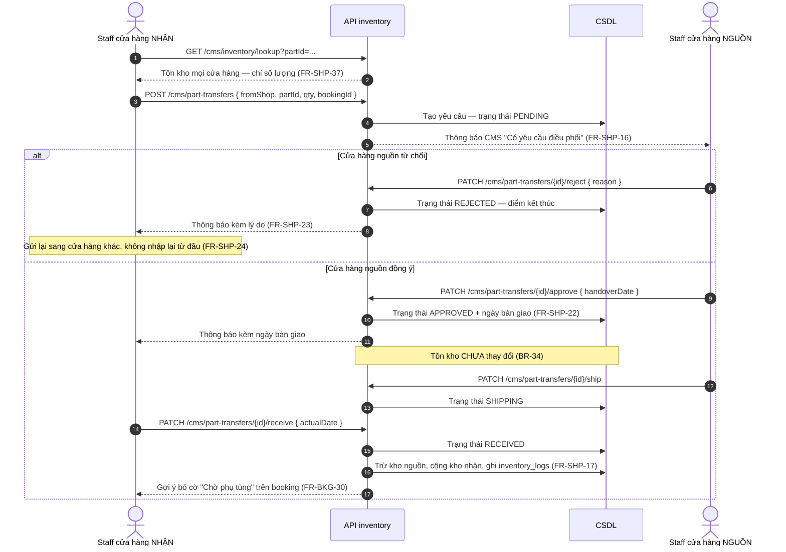

**Điểm dễ hiểu nhầm** (`DEC-17`, `BR-37`): `handoverDate` là **ngày cửa hàng nguồn gửi hàng đi**, không phải ngày cửa hàng nhận nhận được. Giao diện `SCR-A-23` và `SCR-A-04` phải ghi rõ nhãn "Ngày gửi đi" và kèm dòng nhắc nhân viên tự cộng thời gian vận chuyển khi hẹn ngày trả xe cho khách (`FR-SHP-25`).

**Trong lúc chờ phụ tùng:** booking **vẫn ở trạng thái *Chờ xác nhận*** và mang cờ `is_waiting_for_part` (`BR-35`, `DEC-16`). Cờ này loại booking khỏi tiến trình rà soát 16:00 (`BR-36`). Khi đã biết thời điểm có phụ tùng, nhân viên phải chốt **ngày hẹn mới** với khách chứ không giữ ngày cũ đã trôi qua (`BR-38`, `FR-BKG-31`).

### SEQ-06 — Chuyển booking sang cửa hàng khác

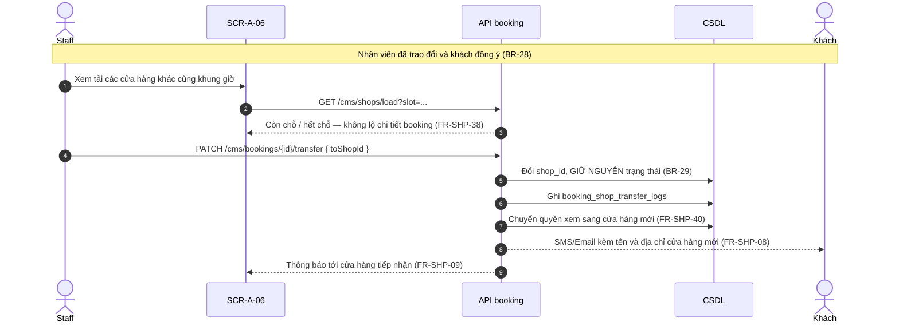

**Giá không đổi khi chuyển cửa hàng** (`BR-32`) vì bảng giá dùng chung toàn chuỗi (`DEC-14`). Đây là lý do thiết kế bảng giá không có cột `shop_id`.

### SEQ-07 — Rà soát booking quá hạn lúc 16:00

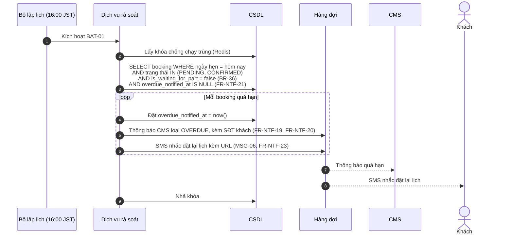

**Bốn quy tắc phải giữ đúng:**

1. Xét booking có **ngày hẹn là chính ngày hôm đó** — mục đích là nhắc trong ngày, không phải xử lý hậu kỳ (`BR-25`, đính chính tại v1.8 của `RD-2026-001`).
2. **Không bao giờ tự hủy booking** — hệ thống chỉ thông báo, quyền hủy vẫn thuộc Admin/Staff sau khi liên hệ khách (`BR-23`).
3. Mỗi booking chỉ sinh **một** thông báo và **một** SMS, dù tiến trình chạy lại nhiều lần — bảo đảm bằng cột `overdue_notified_at` (`FR-NTF-21`, `FR-NTF-24`, `BR-26`).
4. Nếu một lần chạy bị lỗi, lần kế tiếp phải **quét bù** các booking quá hạn chưa xử lý (`FR-NTF-22`) — do đó điều kiện lọc dùng `overdue_notified_at IS NULL` thay vì lọc cứng theo ngày chạy.

⚠ `OQ-30` — chưa chốt việc tiến trình này có chạy vào **ngày cửa hàng nghỉ** hay không. Thiết kế tạm thời: **vẫn chạy**, nhưng thông báo CMS được giữ lại để nhân viên xử lý vào ngày làm việc kế tiếp; SMS vẫn gửi vì khách vẫn cần biết.

### SEQ-08 — Báo giá, hoàn tất dịch vụ và thanh toán

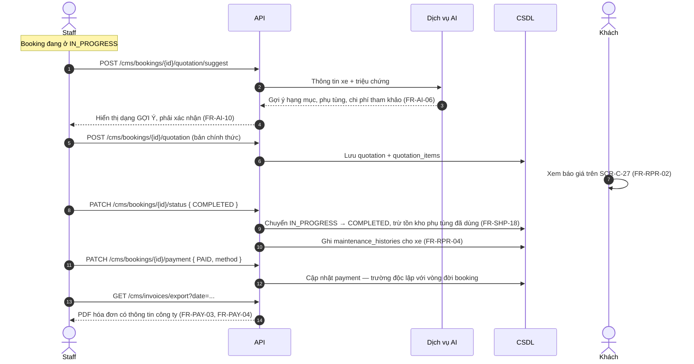

**Trạng thái thanh toán là một trường riêng**, không nằm trong 5 trạng thái booking (mục 7.1 của `RD-2026-001`). Việc trừ tồn kho phụ tùng gắn với thời điểm **hoàn tất dịch vụ**, không phải thời điểm lập báo giá — báo giá có thể bị sửa hoặc khách từ chối.

⚠ `OQ-10` — chưa rõ "hóa đơn theo ngày" là **một hóa đơn tổng hợp cả ngày** hay **từng hóa đơn của các booking trong ngày**. Thiết kế hiện giả định phương án thứ hai (mỗi booking một hóa đơn, màn hình cho phép xuất hàng loạt theo ngày) vì phù hợp với việc `FR-PAY-02` cập nhật thanh toán theo từng booking.

### 4.9 Sơ đồ trạng thái booking

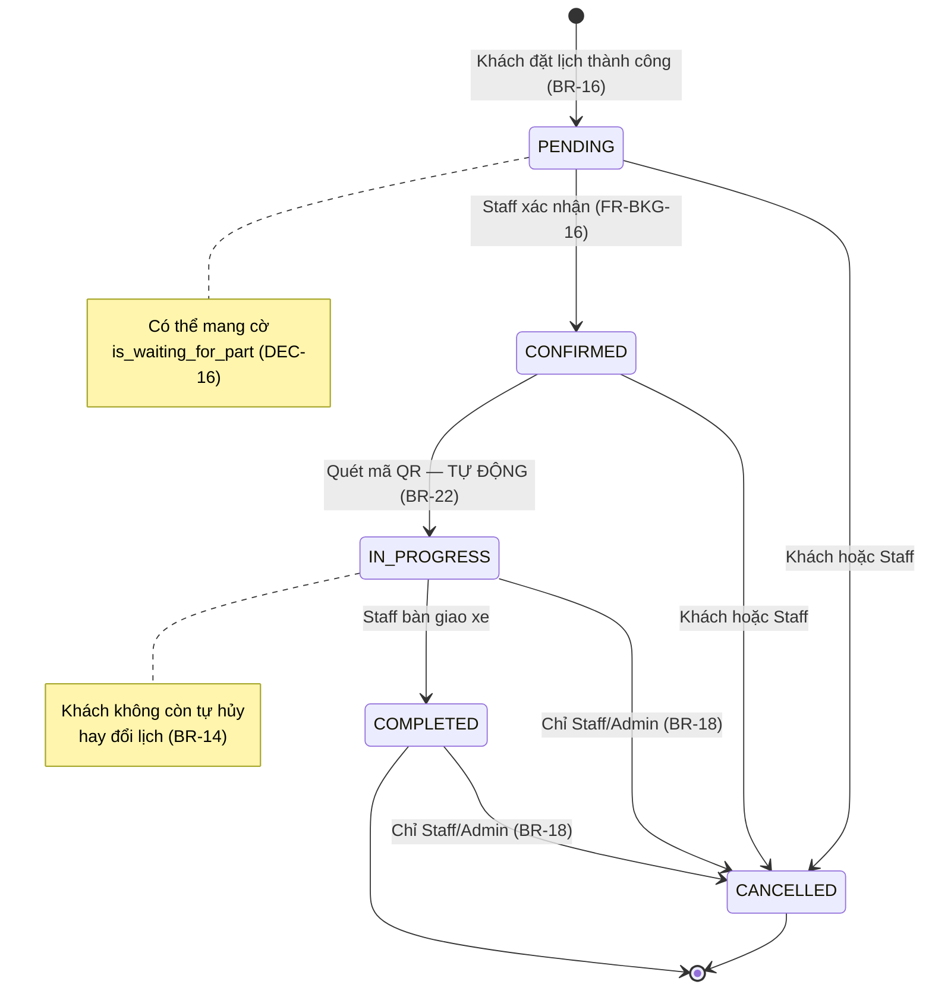

### 4.10 Sơ đồ trạng thái yêu cầu điều phối phụ tùng

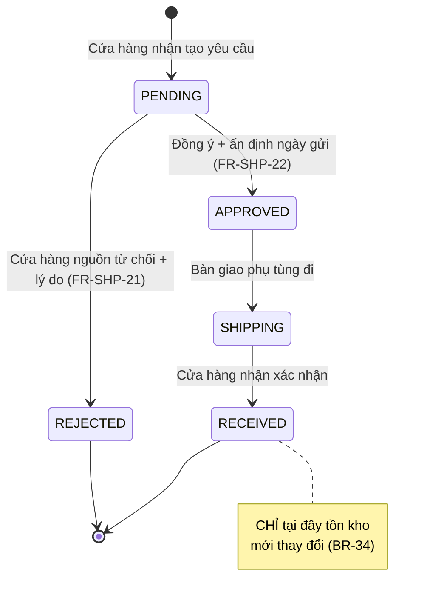

---

## 5. Thiết kế dữ liệu

### 5.1 Sơ đồ quan hệ thực thể

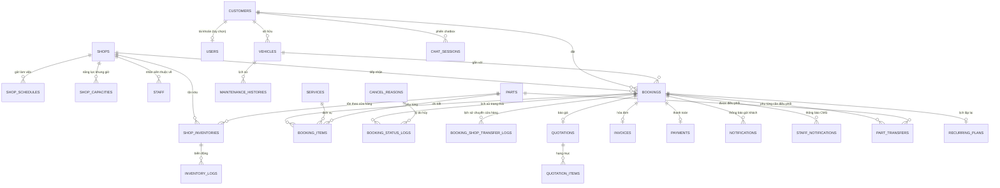

### 5.2 Danh sách bảng

| Mã | Bảng | Mô tả | Thực thể nguồn |
| --- | --- | --- | --- |
| TBL-01 | `shops` | Cửa hàng: tên, địa chỉ, SĐT | Shop |
| TBL-02 | `shop_schedules` | Giờ làm việc và ngày nghỉ theo từng cửa hàng | ShopSchedule |
| TBL-03 | `shop_capacities` | Số booking tối đa mỗi khung giờ | ShopCapacity |
| TBL-04 | `staff` | Tài khoản nhân viên, vai trò, cửa hàng | Staff |
| TBL-05 | `customers` | Hồ sơ khách, khóa nhận diện là SĐT | Customer |
| TBL-06 | `users` | Tài khoản đăng nhập của khách (tùy chọn) | User |
| TBL-07 | `vehicles` | Xe của khách | Vehicle |
| TBL-08 | `bookings` | Lượt đặt lịch — bảng trung tâm | Booking |
| TBL-09 | `booking_items` | Dịch vụ / phụ tùng trong một booking | BookingItem |
| TBL-10 | `booking_status_logs` | Lịch sử chuyển trạng thái | BookingStatusLog |
| TBL-11 | `booking_shop_transfer_logs` | Lịch sử chuyển booking giữa cửa hàng | BookingShopTransferLog |
| TBL-12 | `cancel_reasons` | Danh mục lý do hủy | CancelReason |
| TBL-13 | `services` | Danh mục dịch vụ | Service |
| TBL-14 | `service_prices` | Giá theo loại nhiên liệu / mức độ lỗi | (mở rộng từ Service) |
| TBL-15 | `parts` | Phụ tùng và giá | Part |
| TBL-16 | `shop_inventories` | Tồn kho phụ tùng theo cửa hàng | ShopInventory |
| TBL-17 | `inventory_logs` | Nhật ký biến động tồn kho | InventoryLog |
| TBL-18 | `part_transfers` | Yêu cầu điều phối phụ tùng | PartTransfer |
| TBL-19 | `quotations` | Báo giá | Quotation |
| TBL-20 | `quotation_items` | Hạng mục trong báo giá | (mở rộng từ Quotation) |
| TBL-21 | `maintenance_histories` | Lịch sử bảo dưỡng theo xe | MaintenanceHistory |
| TBL-22 | `invoices` | Hóa đơn | Invoice |
| TBL-23 | `payments` | Trạng thái và hình thức thanh toán | Payment |
| TBL-24 | `notifications` | Lịch sử gửi email/SMS cho khách | Notification |
| TBL-25 | `staff_notifications` | Thông báo nội bộ trong CMS | StaffNotification |
| TBL-26 | `recurring_plans` | Cấu hình đặt lịch lặp lại | RecurringPlan |
| TBL-27 | `chat_sessions` | Phiên chatbox AI | ChatSession |
| TBL-28 | `chat_messages` | Tin nhắn, tệp ảnh/voice đính kèm | (mở rộng từ ChatSession) |
| TBL-29 | `audit_logs` | Nhật ký thao tác quan trọng của Admin | (từ `NFR-SEC-06`) |

Toàn bộ **25 thực thể** liệt kê tại mục 9 của `RD-2026-001` đều có bảng tương ứng; **bốn bảng bổ sung** (`TBL-14`, `TBL-20`, `TBL-28`, `TBL-29`) là kết quả chuẩn hóa ở mức thiết kế, không phải yêu cầu mới.

### 5.3 Định nghĩa các bảng trọng yếu

**TBL-08 `bookings`** — bảng trung tâm của hệ thống.

| Cột | Kiểu | Ràng buộc | Ghi chú |
| --- | --- | --- | --- |
| `id` | uuid | PK | |
| `code` | varchar(16) | UNIQUE | Mã hiển thị cho khách |
| `customer_id` | uuid | FK → `customers` | |
| `vehicle_id` | uuid | FK → `vehicles`, NULL | NULL khi Guest nhập xe trực tiếp |
| `vehicle_snapshot` | jsonb | NULL | Thông tin xe Guest nhập (`FR-VEH-05`) |
| `shop_id` | uuid | FK → `shops`, NOT NULL | **Luôn thuộc đúng một cửa hàng** (`BR-27`) |
| `scheduled_at` | timestamptz | NOT NULL | Lưu UTC, hiển thị theo `Asia/Tokyo` (`BR-10`) |
| `status` | enum | NOT NULL | `PENDING` `CONFIRMED` `IN_PROGRESS` `COMPLETED` `CANCELLED` |
| `access_token` | varchar(64) | UNIQUE, NOT NULL | Ngẫu nhiên ≥128 bit, **không hết hạn** (`NFR-SEC-07`, `BR-15`) |
| `qr_code` | varchar(64) | UNIQUE, NULL | **NULL cho tới khi CONFIRMED** (`BR-44`) |
| `is_waiting_for_part` | boolean | mặc định `false` | Cờ có cấu trúc, **không dùng ghi chú tự do** (`BR-45`) |
| `internal_note` | text | NULL | Chỉ hiển thị trong CMS (`FR-BKG-26`) |
| `overdue_notified_at` | timestamptz | NULL | Chống gửi lặp thông báo quá hạn (`FR-NTF-21`) |
| `contact_result` | enum | NULL | `CALLED` `NO_ANSWER` `CONFIRMED_ABSENT` (`FR-BKG-25`) |
| `locale` | varchar(5) | NOT NULL | Ngôn ngữ khách chọn, dùng cho SMS/email (`FR-NTF-26`) |
| `created_by` | enum | NOT NULL | `CUSTOMER` `STAFF` `ADMIN` — quyết định có sinh thông báo CMS hay không (`BR-20`) |
| `created_at` / `updated_at` | timestamptz | | |

Chỉ mục cần có: `(shop_id, scheduled_at)` cho màn hình lịch và tính năng lực; `(status, scheduled_at)` cho `BAT-01`; `(customer_id)` cho lịch sử khách; UNIQUE trên `access_token` và `qr_code`.

**TBL-10 `booking_status_logs`** — nền tảng cho truy vết và giải quyết khiếu nại (`BR-19`).

| Cột | Kiểu | Ghi chú |
| --- | --- | --- |
| `id` | uuid | |
| `booking_id` | uuid | FK |
| `from_status` / `to_status` | enum | NULL ở bản ghi khởi tạo |
| `actor_type` | enum | `CUSTOMER` `STAFF` `ADMIN` `SYSTEM` |
| `actor_id` | uuid | NULL khi `SYSTEM` |
| `cancel_reason_id` | uuid | FK → `cancel_reasons`, chỉ khi `to_status = CANCELLED` (`BR-24`) |
| `cancel_note` | text | Khi lý do là "Khác" |
| `old_scheduled_at` / `new_scheduled_at` | timestamptz | Ghi lại mỗi lần đổi ngày hẹn (`FR-BKG-34`) |
| `created_at` | timestamptz | |

**TBL-02 `shop_schedules`** và **TBL-03 `shop_capacities`** — nền tảng cho việc tính khung giờ còn chỗ.

| Bảng | Cột chính | Ghi chú |
| --- | --- | --- |
| `shop_schedules` | `shop_id`, `day_of_week`, `open_time`, `close_time`, `is_closed` | Giờ làm việc thường lệ theo thứ trong tuần (`FR-SHP-28`) |
| `shop_schedules` | `shop_id`, `specific_date`, `is_closed` | Ngày nghỉ lễ hoặc nghỉ đột xuất, ghi đè lịch thường lệ (`FR-SHP-30`) |
| `shop_capacities` | `shop_id`, `slot_start`, `slot_end`, `max_bookings` | Số booking tối đa mỗi khung giờ (`FR-SHP-29`) |
| `shop_capacities` | `is_manually_blocked` | Nhân viên đánh dấu quá tải thủ công (`FR-SHP-42`) |

**Cách tính khung giờ còn chỗ:**

```
Khung giờ khả dụng =
    khung giờ nằm trong shop_schedules của cửa hàng
    VÀ ngày không bị đánh dấu is_closed
    VÀ COUNT(bookings đang hoạt động trong khung giờ) < shop_capacities.max_bookings
    VÀ NOT shop_capacities.is_manually_blocked
```

Trong đó "đang hoạt động" là trạng thái khác `CANCELLED`. Phép tính **thuần theo số lượng booking** — dịch vụ **không có thuộc tính thời lượng** và hệ thống không tính toán gì dựa trên thời lượng (`BR-41`, `DEC-25`). Đây là điểm cần giữ đúng: không thêm cột `duration_minutes` vào `services`.

**TBL-18 `part_transfers`**

| Cột | Kiểu | Ghi chú |
| --- | --- | --- |
| `id` | uuid | |
| `from_shop_id` / `to_shop_id` | uuid | Nguồn / nhận |
| `part_id` | uuid | |
| `quantity` | int | |
| `booking_id` | uuid | NULL — booking phát sinh nhu cầu |
| `status` | enum | `PENDING` `APPROVED` `REJECTED` `SHIPPING` `RECEIVED` |
| `reject_reason` | text | Bắt buộc khi `REJECTED` (`FR-SHP-21`) |
| `handover_date` | date | **Ngày gửi đi**, do cửa hàng nguồn ấn định (`BR-37`) |
| `received_date` | date | Ngày nhận thực tế, tích lũy dữ liệu thời gian vận chuyển (`FR-SHP-27`) |
| `created_by` / `responded_by` | uuid | |

**TBL-16 `shop_inventories`**

| Cột | Ghi chú |
| --- | --- |
| `shop_id`, `part_id` | Khóa chính kép — **tồn kho riêng theo cửa hàng**, không có kho chung (`BR-30`) |
| `quantity` | Số lượng hiện có |
| `min_threshold` | Ngưỡng cảnh báo (`FR-SHP-19`) |

Mọi thay đổi `quantity` phải đi kèm một bản ghi `inventory_logs` với `reason` thuộc `{BOOKING_USED, TRANSFER_OUT, TRANSFER_IN, ADJUSTMENT}` (`BR-31`).

**TBL-25 `staff_notifications`**

| Cột | Ghi chú |
| --- | --- |
| `shop_id` | **Bắt buộc** — thông báo chỉ đẩy tới cửa hàng liên quan (`FR-SHP-35`) |
| `event_type` | `BOOKING_CREATED` `BOOKING_CANCELLED` `BOOKING_RESCHEDULED` `BOOKING_OVERDUE` `TRANSFER_REQUESTED` `TRANSFER_APPROVED` `TRANSFER_REJECTED` `BOOKING_SHOP_TRANSFERRED` |
| `booking_id` / `part_transfer_id` | Đối tượng liên quan, bấm vào mở thẳng màn hình chi tiết (`FR-NTF-13`) |
| `payload` | jsonb — tên khách, dịch vụ, giờ hẹn, **SĐT khách** cho loại `BOOKING_OVERDUE` (`FR-NTF-14`, `FR-NTF-20`) |
| `read_at` | NULL nếu chưa đọc (`FR-NTF-15`) |

### 5.4 Danh mục mã dùng chung

| Danh mục | Giá trị |
| --- | --- |
| `booking_status` | `PENDING` · `CONFIRMED` · `IN_PROGRESS` · `COMPLETED` · `CANCELLED` |
| `payment_status` | `UNPAID` · `PAID` |
| `payment_method` | `CASH` · `BANK_TRANSFER` |
| `service_type` | `MAINTENANCE` · `REPAIR` |
| `transfer_status` | `PENDING` · `APPROVED` · `REJECTED` · `SHIPPING` · `RECEIVED` |
| `actor_type` | `CUSTOMER` · `STAFF` · `ADMIN` · `SYSTEM` |
| `role` | `USER` · `STAFF` · `ADMIN` |
| `locale` | `ja` · `vi` · `en` |
| `notify_channel` | `SMS` · `EMAIL` |

### 5.5 Quy tắc chung về dữ liệu

| # | Quy tắc | Căn cứ |
| --- | --- | --- |
| 1 | Mọi cột thời gian lưu `timestamptz` theo UTC; quy đổi sang `Asia/Tokyo` ở tầng hiển thị | `BR-10`, `NFR-I18N-03` |
| 2 | Khóa chính dùng UUID v7 — không lộ số thứ tự qua URL | `NFR-SEC-07` |
| 3 | **Xóa mềm** (`deleted_at`) cho `bookings`, `customers`, `vehicles`, `services`, `parts` — dữ liệu lịch sử phải tra lại được | `FR-BKG-13a` |
| 4 | Mật khẩu băm bằng `argon2id`, không lưu dạng rõ | `NFR-SEC-02` |
| 5 | Bảng giá **không có cột `shop_id`** — giá dùng chung toàn chuỗi | `BR-32`, `DEC-14` |
| 6 | `services` **không có cột thời lượng** | `BR-41`, `DEC-25` |
| 7 | Sao lưu toàn bộ CSDL hằng ngày, giữ tối thiểu 30 ngày | `NFR-PRF-04` |

⚠ `OQ-06` — thời hạn lưu trữ dữ liệu cá nhân theo luật Nhật Bản chưa được xác nhận. Thiết kế hiện chưa có tiến trình xóa dữ liệu định kỳ; cần bổ sung khi có câu trả lời.

---

## 6. Thiết kế API

### 6.1 Nguyên tắc chung

| Hạng mục | Quy định |
| --- | --- |
| Kiểu | REST over HTTPS, dữ liệu JSON |
| Tiền tố | `/api/v1` — đánh phiên bản ngay từ đầu để mở rộng về sau (`NFR-PRF-05`) |
| Phân nhóm | `/api/v1/...` cho site khách hàng · `/api/v1/cms/...` cho site quản trị |
| Xác thực | `Authorization: Bearer <access_token>`; riêng nhóm `/t/{token}` dùng token trong đường dẫn |
| Phân trang | `?page=1&limit=20`, trả kèm `total`, `page`, `limit` |
| Sắp xếp / lọc | `?sort=-createdAt&status=PENDING` |
| Ngôn ngữ | Header `Accept-Language: ja` / `vi` / `en` quyết định ngôn ngữ thông điệp lỗi (`NFR-I18N-04`) |
| Múi giờ | Mọi giá trị thời gian trao đổi theo ISO 8601 có offset (`BR-10`) |
| Tài liệu API | Sinh tự động bằng `@nestjs/swagger`, xuất OpenAPI cho tầng giao diện dùng lại |

### 6.2 Định dạng phản hồi lỗi

```json
{
  "error": {
    "code": "ERR-BKG-01",
    "message": "Khung giờ đã hết chỗ. Vui lòng chọn khung giờ khác.",
    "field": "scheduledAt"
  }
}
```

Thông điệp trả về dùng **ngôn ngữ đời thường, không chứa thuật ngữ kỹ thuật** (`NFR-UX-04`), lấy từ tệp dịch theo `Accept-Language`.

| Mã lỗi | HTTP | Tình huống |
| --- | --- | --- |
| `ERR-BKG-01` | 409 | Khung giờ đã hết chỗ (`BR-40`) |
| `ERR-BKG-02` | 409 | Chuyển trạng thái không hợp lệ theo vòng đời |
| `ERR-BKG-03` | 403 | Khách hủy/đổi lịch khi booking đã qua *Xác nhận* (`BR-14`) |
| `ERR-BKG-04` | 400 | Thiếu lý do hủy khi Staff hủy booking (`FR-BKG-23`) |
| `ERR-SHP-01` | 400 | Đặt lịch ngoài giờ làm việc hoặc vào ngày nghỉ (`FR-BKG-35`) |
| `ERR-SHP-02` | 403 | Staff truy cập dữ liệu ngoài cửa hàng mình (`FR-SHP-36`) |
| `ERR-QR-01` | 404 | Mã QR không tồn tại hoặc booking đã hủy (`FR-QRC-12`) |
| `ERR-INV-01` | 409 | Tồn kho không đủ để tạo yêu cầu điều phối |
| `ERR-INV-02` | 409 | Chuyển trạng thái yêu cầu điều phối không hợp lệ |
| `ERR-AUT-01` | 401 | Sai thông tin đăng nhập |
| `ERR-AUT-02` | 429 | Vượt giới hạn số lần đặt lịch theo SĐT/IP (`NFR-SEC-08`) |

### 6.3 API site khách hàng

**API-AUT — Xác thực**

| Phương thức | Đường dẫn | Mô tả | FR |
| --- | --- | --- | --- |
| POST | `/auth/register` | Đăng ký bằng SĐT hoặc email | `FR-AUT-01` |
| POST | `/auth/login` | Đăng nhập bằng email hoặc SĐT | `FR-AUT-02` |
| POST | `/auth/refresh` | Làm mới access token | (thiết kế) |
| POST | `/auth/logout` | Đăng xuất, thu hồi refresh token | (thiết kế) |
| POST | `/auth/forgot-password` | Gửi link đặt lại mật khẩu | `FR-AUT-08` |
| POST | `/auth/reset-password` | Đặt mật khẩu mới | `FR-AUT-08` |
| POST | `/auth/otp/request` | ⚠ Gửi OTP xác thực SĐT khi Guest đặt lịch | `FR-AUT-07`, `OQ-14` |
| POST | `/auth/otp/verify` | ⚠ Xác thực mã OTP | `FR-AUT-07`, `OQ-14` |
| GET/PATCH | `/me` | Xem / cập nhật hồ sơ cá nhân | `FR-AUT-09` |

**API-VEH — Phương tiện**

| Phương thức | Đường dẫn | Mô tả | FR |
| --- | --- | --- | --- |
| GET | `/vehicles` | Danh sách xe của tôi | `FR-VEH-01` |
| POST | `/vehicles` | Thêm xe | `FR-VEH-01` |
| PATCH/DELETE | `/vehicles/{id}` | Sửa / xóa xe | `FR-VEH-01` |
| GET | `/vehicles/{id}/maintenance-histories` | Lịch sử bảo dưỡng của xe | `FR-BKG-10` |

**API-CAT — Dịch vụ, cửa hàng (công khai)**

| Phương thức | Đường dẫn | Mô tả | FR |
| --- | --- | --- | --- |
| GET | `/services` | Danh sách dịch vụ và giá tham khảo | `FR-SRV-05` |
| GET | `/services/{id}` | Chi tiết dịch vụ | `FR-SRV-02`, `FR-SRV-03` |
| GET | `/shops` | Danh sách cửa hàng kèm địa chỉ, giờ mở cửa | `FR-SHP-05` |
| GET | `/shops/{id}` | Chi tiết cửa hàng | `FR-SHP-05` |
| GET | `/shops/{id}/availability?from=&to=` | **Chỉ trả về khung giờ còn chỗ** | `FR-SHP-31`, `FR-BKG-35` |

**API-BKG — Đặt lịch**

| Phương thức | Đường dẫn | Mô tả | FR |
| --- | --- | --- | --- |
| POST | `/bookings` | Tạo booking (không bắt buộc đăng nhập) | `FR-AUT-05`, `FR-BKG-01` |
| GET | `/bookings` | Danh sách booking của tôi (cần đăng nhập) | `FR-BKG-08` |
| GET | `/bookings/{id}` | Chi tiết booking | `FR-BKG-08`, `FR-BKG-18` |
| PATCH | `/bookings/{id}/cancel` | Hủy — chỉ ở `PENDING`/`CONFIRMED` | `FR-BKG-05` |
| PATCH | `/bookings/{id}/reschedule` | Đổi lịch — cùng điều kiện trạng thái | `FR-BKG-06` |
| GET | `/bookings/{id}/qr` | Lấy mã QR — 404 nếu chưa `CONFIRMED` | `FR-QRC-02`, `FR-QRC-10` |
| GET | `/bookings/{id}/quotation` | Xem báo giá | `FR-RPR-02` |
| POST | `/recurring-plans` | Tạo lịch lặp lại — chỉ User đã đăng nhập, chỉ dịch vụ Bảo dưỡng | `FR-BKG-07`, `FR-BKG-14` |

**API-TOK — Tra cứu bằng token (Guest)**

| Phương thức | Đường dẫn | Mô tả | FR |
| --- | --- | --- | --- |
| GET | `/t/{token}` | Chi tiết booking, che bớt thông tin cá nhân | `FR-BKG-13`, `NFR-SEC-10` |
| PATCH | `/t/{token}/cancel` | Hủy booking qua link | `FR-BKG-13` |
| PATCH | `/t/{token}/reschedule` | Đổi lịch qua link | `FR-BKG-13` |
| GET | `/t/{token}/qr` | Mở trang mã QR | `FR-QRC-02` |

Nhóm này gắn header `X-Robots-Tag: noindex` và `Referrer-Policy: no-referrer` (`NFR-SEC-09`), đồng thời áp giới hạn tần suất theo token để chống dò tìm.

**API-AI — Chatbox**

| Phương thức | Đường dẫn | Mô tả | FR |
| --- | --- | --- | --- |
| POST | `/chat/sessions` | Mở phiên chat | `FR-AI-01` |
| POST | `/chat/sessions/{id}/messages` | Gửi tin nhắn văn bản | `FR-AI-02` |
| POST | `/chat/sessions/{id}/attachments` | Tải ảnh hoặc tệp ghi âm | `FR-AI-03`, `FR-AI-04` |
| GET | `/chat/sessions/{id}/suggestion` | Gợi ý dịch vụ do AI phân loại | `FR-AI-05` |

### 6.4 API site quản trị

**API-CMS-BKG — Booking**

| Phương thức | Đường dẫn | Mô tả | FR |
| --- | --- | --- | --- |
| GET | `/cms/bookings` | Danh sách, lọc theo `status`, `overdue`, `waitingForPart`, `shopId` | `FR-BKG-21`, `24`, `29` |
| POST | `/cms/bookings` | Tạo thay khách, cho phép vượt năng lực kèm cảnh báo | `FR-BKG-03`, `FR-SHP-33` |
| GET | `/cms/bookings/{id}` | Chi tiết kèm lịch sử trạng thái | `FR-BKG-11` |
| PATCH | `/cms/bookings/{id}/confirm` | `PENDING` → `CONFIRMED`, sinh QR | `FR-BKG-16`, `BR-44` |
| PATCH | `/cms/bookings/{id}/status` | Chuyển trạng thái thủ công | `FR-BKG-17` |
| PATCH | `/cms/bookings/{id}/cancel` | Hủy ở **mọi trạng thái**, bắt buộc `cancelReasonId` | `FR-BKG-19`, `FR-BKG-23` |
| PATCH | `/cms/bookings/{id}/reschedule` | Chốt ngày hẹn mới | `FR-BKG-31`, `FR-BKG-33` |
| PATCH | `/cms/bookings/{id}/transfer` | Chuyển sang cửa hàng khác | `FR-SHP-06` |
| PATCH | `/cms/bookings/{id}/waiting-part` | Bật/tắt cờ Chờ phụ tùng | `FR-BKG-27` |
| PATCH | `/cms/bookings/{id}/internal-note` | Ghi chú nội bộ | `FR-BKG-26` |
| PATCH | `/cms/bookings/{id}/contact-result` | Ghi kết quả liên hệ khách | `FR-BKG-25` |

**API-CMS-QRC — Tiếp nhận xe**

| Phương thức | Đường dẫn | Mô tả | FR |
| --- | --- | --- | --- |
| POST | `/cms/qr/scan` | Quét QR — tra cứu **và** chuyển trạng thái, idempotent | `FR-QRC-03`…`09` |
| GET | `/cms/bookings/search?phone=&name=` | Tra cứu thủ công khi khách chưa có QR | `FR-QRC-11` |

**API-CMS-RPR — Báo giá & sửa chữa**

| Phương thức | Đường dẫn | Mô tả | FR |
| --- | --- | --- | --- |
| POST | `/cms/bookings/{id}/quotation` | Lập báo giá | `FR-RPR-01` |
| POST | `/cms/bookings/{id}/quotation/suggest` | Nhận gợi ý từ AI | `FR-AI-06` |
| PATCH | `/cms/bookings/{id}/progress` | Cập nhật tiến độ sửa chữa | `FR-RPR-03` |
| POST | `/cms/ai/tech-assistant` | ⚠ Hỏi đáp kỹ thuật bằng ngôn ngữ tự nhiên | `FR-AI-07`, `OQ-11` |

**API-CMS-INV — Tồn kho & điều phối**

| Phương thức | Đường dẫn | Mô tả | FR |
| --- | --- | --- | --- |
| GET | `/cms/inventory` | Tồn kho cửa hàng mình | `FR-SHP-12` |
| GET | `/cms/inventory/lookup?partId=` | Tồn kho mọi cửa hàng — **chỉ số lượng** | `FR-SHP-13`, `FR-SHP-37` |
| GET | `/cms/inventory/logs` | Nhật ký biến động | `FR-SHP-20` |
| POST | `/cms/part-transfers` | Tạo yêu cầu điều phối | `FR-SHP-14` |
| GET | `/cms/part-transfers?direction=` *in* hoặc *out* | Danh sách yêu cầu đến / đi | `FR-SHP-15` |
| PATCH | `/cms/part-transfers/{id}/approve` | Đồng ý + ấn định **ngày gửi đi** | `FR-SHP-22` |
| PATCH | `/cms/part-transfers/{id}/reject` | Từ chối + lý do | `FR-SHP-21` |
| PATCH | `/cms/part-transfers/{id}/ship` | Đánh dấu đã bàn giao đi | (mục 7.2 RD) |
| PATCH | `/cms/part-transfers/{id}/receive` | Xác nhận đã nhận — **thời điểm tồn kho thay đổi** | `FR-SHP-17`, `BR-34` |
| POST | `/cms/part-transfers/{id}/resend` | Gửi lại yêu cầu sang cửa hàng khác | `FR-SHP-24` |

**API-CMS-SHP — Cấu hình cửa hàng**

| Phương thức | Đường dẫn | Mô tả | FR |
| --- | --- | --- | --- |
| GET/POST/PATCH/DELETE | `/cms/shops` | Quản lý cửa hàng (Admin) | `FR-SHP-01` |
| GET/PUT | `/cms/shops/{id}/schedules` | Giờ làm việc, ngày nghỉ (Admin) | `FR-SHP-28`, `FR-SHP-30` |
| GET/PUT | `/cms/shops/{id}/capacities` | Năng lực khung giờ (Admin) | `FR-SHP-29` |
| GET | `/cms/shops/load?slot=` | Tải theo khung giờ — của mình và **mức độ bận** của cửa hàng khác | `FR-SHP-32`, `FR-SHP-38` |
| PATCH | `/cms/shops/{id}/slots/{slotId}/block` | Đánh dấu quá tải thủ công | `FR-SHP-42` |

**API-CMS-MST — Danh mục & quản trị**

| Phương thức | Đường dẫn | Mô tả | FR |
| --- | --- | --- | --- |
| GET/POST/PATCH/DELETE | `/cms/services` | Quản lý dịch vụ và giá (Admin) | `FR-SRV-04`, `FR-SRV-06` |
| GET/POST/PATCH/DELETE | `/cms/parts` | Quản lý phụ tùng (Admin) | `FR-PRT-01` |
| POST | `/cms/parts/ai-extract` | Tải ảnh → AI sinh thông tin phụ tùng | `FR-PRT-03`, `FR-AI-08` |
| GET/POST/PATCH/DELETE | `/cms/cancel-reasons` | Danh mục lý do hủy (Admin) | `FR-BKG-23` |
| GET/POST/PATCH/DELETE | `/cms/staff` | Người dùng và phân quyền (Admin) | `FR-ADM-05`, `FR-SHP-02` |
| GET | `/cms/customers` | Quản lý khách hàng | `FR-ADM-06` |

**API-CMS-PAY / RPT / NTF**

| Phương thức | Đường dẫn | Mô tả | FR |
| --- | --- | --- | --- |
| PATCH | `/cms/bookings/{id}/payment` | Cập nhật trạng thái thanh toán | `FR-PAY-02` |
| GET | `/cms/invoices/export?date=&format=pdf` | Xuất hóa đơn | `FR-PAY-03` |
| GET | `/cms/reports?groupBy=` *day, month, vehicleType, shop, cancelReason* | Thống kê | `FR-RPT-02`, `03`, `06`, `07` |
| GET | `/cms/reports/export?format=` *xlsx* hoặc *pdf* | Export báo cáo | `FR-RPT-04` |
| GET | `/cms/notifications` | Danh sách thông báo CMS | `FR-NTF-12` |
| PATCH | `/cms/notifications/{id}/read` | Đánh dấu đã đọc | `FR-NTF-15` |
| PATCH | `/cms/notifications/read-all` | Đọc tất cả | `FR-NTF-15` |
| WS | `/ws/notifications` | Kênh đẩy thời gian thực, có lọc theo `shop_id` | `FR-NTF-16`, `FR-SHP-35` |

---

## 7. Thiết kế xác thực & phân quyền

### 7.1 Ba cơ chế truy cập song song

Hệ thống có **ba** cách một người truy cập được dữ liệu booking, và chúng độc lập với nhau:

| # | Cơ chế | Đối tượng | Thời hạn | Ghi chú |
| --- | --- | --- | --- | --- |
| 1 | **JWT khách hàng** | User | Access 15 phút, refresh 30 ngày | Refresh token lưu trong cookie `HttpOnly` `Secure` `SameSite=Strict` |
| 2 | **JWT nhân viên** | Staff, Admin | Access 15 phút, refresh 8 giờ | Thời hạn ngắn hơn vì máy quầy dùng chung |
| 3 | **Token tra cứu** | Guest | **Không hết hạn** (`BR-15`) | Chuỗi ngẫu nhiên ≥128 bit sinh bằng `crypto.randomBytes` (`NFR-SEC-07`) |

Cơ chế thứ ba là điểm cần chú ý về bảo mật: vì link không bao giờ hết hạn, **độ mạnh của token là lớp bảo vệ duy nhất**. Các biện pháp bù trừ:

- Token dài 32 byte, mã hóa base64url — không thể dò bằng vét cạn.
- Trang tra cứu gắn `noindex` và `Referrer-Policy: no-referrer` (`NFR-SEC-09`).
- Chỉ hiển thị thông tin của đúng booking đó, che bớt số điện thoại (`NFR-SEC-10`).
- Giới hạn tần suất truy cập theo IP cho nhóm `/t/{token}`.

### 7.2 Kiểm soát quyền hai tầng

Mọi API của CMS đi qua **hai lớp kiểm tra liên tiếp** ở phía máy chủ (`NFR-SEC-03`, `FR-SHP-36`):

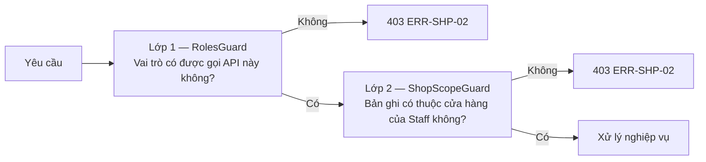

`ShopScopeGuard` hoạt động theo nguyên tắc:

| Vai trò | Hành vi |
| --- | --- |
| `ADMIN` | Bỏ qua lọc — xem được mọi cửa hàng (`FR-SHP-39`, `BR-47`) |
| `STAFF` | Tự động thêm điều kiện `shop_id = <cửa hàng của tài khoản>` vào **mọi** truy vấn (`BR-42`) |

**Ba ngoại lệ có kiểm soát** (`BR-43`) được khai báo tường minh, không phải bằng cách tắt guard:

| Ngoại lệ | API | Dữ liệu được thấy |
| --- | --- | --- |
| Tồn kho | `GET /cms/inventory/lookup` | **Chỉ số lượng** phụ tùng, không kèm booking hay khách hàng (`FR-SHP-37`) |
| Tình trạng tải | `GET /cms/shops/load` | **Chỉ còn chỗ / hết chỗ**, không kèm chi tiết booking (`FR-SHP-38`) |
| Vai trò Admin | Toàn bộ | Không giới hạn (`FR-SHP-39`) |

**Khi booking chuyển cửa hàng**, quyền xem chuyển theo `shop_id` mới — cửa hàng cũ thôi thấy, cửa hàng mới bắt đầu thấy (`FR-SHP-40`). ⚠ `OQ-44` đang bỏ ngỏ việc cửa hàng cũ có nên giữ quyền xem lịch sử phần việc họ đã làm hay không; thiết kế hiện theo phương án chặt nhất (mất quyền hoàn toàn) và có thể nới ra sau bằng một điều kiện `OR EXISTS (booking_shop_transfer_logs WHERE from_shop_id = ...)`.

### 7.3 Ma trận quyền theo nhóm API

| Nhóm API | Guest | User | Staff | Admin |
| --- | :---: | :---: | :---: | :---: |
| `GET /services`, `/shops` | ✔ | ✔ | ✔ | ✔ |
| `POST /bookings` | ✔ | ✔ | — | — |
| `GET /bookings`, `/vehicles` | — | ✔ | — | — |
| `/t/{token}` | ✔ | ✔ | — | — |
| `/chat/*` | ✔ | ✔ | — | — |
| `/cms/bookings/*` | — | — | ⬤ | ✔ |
| `/cms/qr/scan` | — | — | ⬤ | ✔ |
| `/cms/inventory`, `/cms/part-transfers` | — | — | ⬤ | ✔ |
| `/cms/inventory/lookup`, `/cms/shops/load` | — | — | ✔ | ✔ |
| `/cms/shops`, `/cms/services`, `/cms/parts`, `/cms/staff` | — | — | — | ✔ |
| `/cms/bookings/{id}/payment` | — | — | ⬤ | ✔ |
| `/cms/reports` (mọi phạm vi) | — | — | **—** | ✔ |

⬤ = có quyền nhưng chỉ trong phạm vi cửa hàng mình.

**Hai quyền dễ bị gộp nhầm** (`DEC-28`) — chúng đi theo hai hướng ngược nhau:

| Quyền | Staff | Lý do |
| --- | :---: | --- |
| Cập nhật trạng thái thanh toán | **Có** (cửa hàng mình) | Thao tác hằng ngày tại quầy khi khách trả tiền (`BR-07`) |
| Xem báo cáo, thống kê | **Không** | Kể cả báo cáo của chính cửa hàng mình — `RolesGuard` chặn ngay ở lớp đầu, không cần tới `ShopScopeGuard` (`FR-RPT-01`, `BR-08`) |

⚠ `OQ-05` — điểm duy nhất còn lại: Staff có được **xóa** booking và dữ liệu không. Thiết kế hiện **không cấp quyền xóa** — chỉ tạo và sửa.

### 7.4 Chống lạm dụng form đặt lịch

Vì booking không cần đăng nhập (`DEC-01`), form này là điểm dễ bị lạm dụng nhất (`NFR-SEC-08`):

| Biện pháp | Cấu hình đề xuất |
| --- | --- |
| Giới hạn theo SĐT | Tối đa 3 booking đang hoạt động cùng lúc trên một số điện thoại |
| Giới hạn theo IP | Tối đa 10 lượt tạo booking mỗi giờ |
| CAPTCHA | Chỉ kích hoạt khi vượt ngưỡng, để không cản trở người lớn tuổi (`NFR-UX-01`) |
| OTP qua SMS | ⚠ `OQ-14` — chưa chốt. Thiết kế đã chừa sẵn `POST /auth/otp/*` và cột `phone_verified_at` trên `customers` để bật lên khi có quyết định |

Đây là một đánh đổi cần khách hàng quyết: OTP chặn được số điện thoại giả nhưng thêm một bước thao tác, đi ngược yêu cầu "dễ dùng cho người lớn tuổi" và phát sinh chi phí SMS.

---

## 8. Thiết kế thông báo

Hệ thống có **hai luồng thông báo độc lập**, không thay thế nhau (`BR-21`):

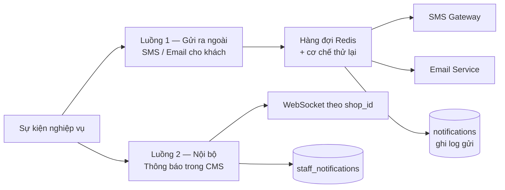

### 8.1 Bảng sự kiện → kênh

| Sự kiện | SMS khách | Email khách | Thông báo CMS | Căn cứ |
| --- | :---: | :---: | :---: | --- |
| Khách tạo booking | ✔ `MSG-01` | ✔ (nếu có email) | ✔ | `FR-BKG-04`, `FR-NTF-08` |
| Staff xác nhận booking | ✔ `MSG-02` | ✔ | — | `FR-BKG-16`, `FR-NTF-07` |
| Nhắc trước giờ hẹn 12 tiếng | ✔ `MSG-03` | ✔ | — | `FR-NTF-02`, `BR-05` |
| Khách tự hủy | — | — | ✔ | `FR-NTF-09` |
| Staff hủy booking | ✔ `MSG-04` | ✔ | — | `FR-NTF-07` |
| Khách đổi lịch | — | — | ✔ | `FR-NTF-10` |
| Staff chốt ngày hẹn mới | ✔ `MSG-05` | ✔ | — | `FR-BKG-33` |
| Booking quá hạn (16:00) | ✔ `MSG-06` | — | ✔ | `FR-NTF-18`, `FR-NTF-23` |
| Chuyển sang cửa hàng khác | ✔ `MSG-07` | ✔ | ✔ (cửa hàng nhận) | `FR-SHP-08`, `FR-SHP-09` |
| Gần đến kỳ bảo dưỡng | ✔ `MSG-08` | ✔ | — | `FR-NTF-03` |
| Yêu cầu điều phối phụ tùng | — | — | ✔ | `FR-SHP-16` |
| Yêu cầu được duyệt / từ chối | — | — | ✔ | `FR-SHP-23` |

**Quy tắc nền tảng** (`FR-NTF-04`, `DEC-01`): **SMS là kênh bắt buộc** cho mọi thông báo gửi khách, vì số điện thoại là thông tin duy nhất chắc chắn có. Email chỉ gửi thêm khi khách đã cung cấp.

**Thao tác do Admin/Staff thực hiện không sinh thông báo CMS** (`BR-20`) — chỉ thao tác của khách mới sinh. Điều này được kiểm tra qua cột `bookings.created_by` và `actor_type` trong log.

### 8.2 Mẫu thông báo

Mỗi mẫu có 3 bản ngôn ngữ (`ja`, `vi`, `en`), chọn theo `bookings.locale` (`FR-NTF-05`, `FR-NTF-26`).

| Mã | Kênh | Nội dung chính | Biến |
| --- | --- | --- | --- |
| `MSG-01` | SMS | Đã nhận yêu cầu đặt lịch + **link tra cứu** | `{customerName} {serviceName} {scheduledAt} {shopName} {trackingUrl}` |
| `MSG-02` | SMS + Email | Lịch hẹn đã được xác nhận + **link mở mã QR** | `{scheduledAt} {shopName} {shopAddress} {qrUrl}` |
| `MSG-03` | SMS + Email | Nhắc lịch trước 12 tiếng | `{scheduledAt} {shopName} {shopAddress}` |
| `MSG-04` | SMS + Email | Lịch hẹn đã bị hủy + SĐT cửa hàng | `{scheduledAt} {shopPhone}` |
| `MSG-05` | SMS + Email | Lịch hẹn đã đổi sang ngày mới | `{oldScheduledAt} {newScheduledAt} {shopName}` |
| `MSG-06` | SMS | Chưa thấy quý khách đến — mời đặt lại lịch + **URL đặt lịch** | `{bookingUrl}` |
| `MSG-07` | SMS + Email | Lịch hẹn chuyển sang cửa hàng mới | `{newShopName} {newShopAddress} {scheduledAt}` |
| `MSG-08` | SMS + Email | Sắp đến kỳ bảo dưỡng + **URL đặt lịch** | `{vehicleName} {bookingUrl}` |

⚠ `OQ-29` — chưa chốt URL trong `MSG-06` dẫn tới form đặt lịch **điền sẵn** thông tin xe và dịch vụ từ booking cũ, hay trang đặt lịch trống. Thiết kế nghiêng về phương án điền sẵn (`/booking?from={bookingId}`) vì thuận tiện hơn cho người lớn tuổi (`NFR-UX-01`), nhưng cần xác nhận.

⚠ `OQ-31` — lượt quét 16:00 gộp hai nhóm khác nhau (khách đã lỡ giờ hẹn và khách còn hẹn vào cuối ngày). Thiết kế hiện dùng **chung một mẫu** `MSG-06`; nếu khách hàng muốn tách, cần bổ sung `MSG-06a` / `MSG-06b` và một điều kiện so sánh `scheduled_at` với thời điểm chạy.

### 8.3 Cơ chế gửi và thử lại

| Hạng mục | Thiết kế |
| --- | --- |
| Hàng đợi | BullMQ trên Redis, hàng đợi riêng cho SMS và Email |
| Thử lại | 3 lần, giãn cách lũy thừa (1 phút → 5 phút → 30 phút) |
| Ghi log | Mọi lần gửi ghi vào `TBL-24 notifications` kèm trạng thái thành công/thất bại (`FR-NTF-06`) |
| Chống trùng | Khóa duy nhất `(booking_id, message_code)` cho các mẫu chỉ được gửi một lần: `MSG-06` (`FR-NTF-24`) |
| Hủy gửi | Không gửi `MSG-06` nếu booking đã bị hủy trước thời điểm rà soát (`FR-NTF-25`) |

### 8.4 Thông báo thời gian thực trong CMS

| Hạng mục | Thiết kế |
| --- | --- |
| Giao thức | WebSocket (Socket.IO), phòng theo `shop:{shopId}` |
| Lọc | Máy chủ chỉ phát vào phòng của cửa hàng liên quan (`FR-SHP-35`) — không lọc ở phía trình duyệt |
| Badge | Số chưa đọc lấy từ `staff_notifications`, cập nhật khi có sự kiện mới (`FR-NTF-11`) |
| Dự phòng | Nếu WebSocket mất kết nối, tự chuyển sang gọi `GET /cms/notifications?unreadOnly=true` mỗi 30 giây |

⚠ `OQ-23` — chưa chốt giữa realtime và polling, và chưa rõ quầy lễ tân có cần **âm thanh cảnh báo** khi có booking mới hay không. Thiết kế chọn realtime có dự phòng polling; phần âm thanh đã chừa chỗ ở tầng giao diện nhưng mặc định tắt.

---

## 9. Thiết kế xử lý theo lô

Toàn bộ tiến trình chạy theo múi giờ `Asia/Tokyo` (`BR-10`). Mỗi tiến trình lấy một khóa trên Redis trước khi chạy để không bị chạy trùng khi triển khai nhiều bản sao.

| Mã | Tiến trình | Lịch chạy | Việc thực hiện | FR |
| --- | --- | --- | --- | --- |
| `BAT-01` | Rà soát booking quá hạn | **16:00 hằng ngày** | Xem `SEQ-07` | `FR-NTF-18`…`22`, `FR-NTF-23`…`25` |
| `BAT-02` | Nhắc lịch trước giờ hẹn | Mỗi 15 phút | Tìm booking có `scheduled_at` cách hiện tại 12 tiếng (±7,5 phút), gửi `MSG-03` | `FR-NTF-02`, `BR-05` |
| `BAT-03` | Nhắc kỳ bảo dưỡng tiếp theo | 09:00 hằng ngày | Dựa trên lịch sử bảo dưỡng và chu kỳ, gửi `MSG-08` kèm URL đặt lịch | `FR-NTF-03`, `FR-AI-09` |
| `BAT-04` | Sinh booking từ lịch lặp lại | 09:00 hằng ngày | Tạo booking mới theo `recurring_plans` | `FR-BKG-07` |
| `BAT-05` | Cảnh báo tồn kho thấp | 08:00 hằng ngày | So `quantity` với `min_threshold`, đẩy thông báo CMS | `FR-SHP-19` |
| `BAT-06` | Cảnh báo phụ tùng chưa tới | 08:00 hằng ngày | Yêu cầu ở `SHIPPING` quá `handover_date` + khoảng dự phòng | `FR-SHP-26` ⚠ `OQ-41` |
| `BAT-07` | Nhắc booking tồn đọng ở *Chờ xác nhận* | Mỗi giờ | Đẩy thông báo CMS cho booking chưa xử lý quá ngưỡng | `FR-BKG-22` ⚠ `OQ-20` |
| `BAT-08` | Cảnh báo booking chờ phụ tùng quá ngày hẹn | 08:00 hằng ngày | Booking `PENDING` có `scheduled_at` đã qua — nhắc chốt ngày mới | `FR-BKG-32` |
| `BAT-09` | Sao lưu cơ sở dữ liệu | 02:00 hằng ngày | Sao lưu toàn bộ, giữ 30 ngày | `NFR-PRF-04` |

**Hai ngưỡng chưa có giá trị:**

- ⚠ `OQ-20` — bao lâu thì coi là booking bị bỏ quên ở *Chờ xác nhận*? `BAT-07` tạm đặt **4 giờ làm việc**.
- ⚠ `OQ-41` — khoảng dự phòng bao nhiêu ngày kể từ ngày gửi thì cảnh báo phụ tùng chưa tới? `BAT-06` tạm đặt **3 ngày**.

Cả hai được đưa vào bảng cấu hình hệ thống để đổi được mà không phải sửa mã.

---

## 10. Thiết kế tích hợp AI

### 10.1 Năm điểm chạm AI

| # | Điểm chạm | Vị trí | Loại mô hình | FR |
| --- | --- | --- | --- | --- |
| 1 | Chatbox mô tả tình trạng xe | `SCR-C-26` | LLM + Vision + Speech-to-Text | `FR-AI-01`…`05` |
| 2 | Gợi ý hạng mục và chi phí báo giá | `SCR-A-11` | LLM có ngữ cảnh danh mục dịch vụ/phụ tùng | `FR-AI-06` |
| 3 | Tra cứu kỹ thuật cho thợ | `SCR-A-31` | LLM + tra cứu tài liệu (RAG) | `FR-AI-07` ⚠ |
| 4 | Nhập liệu phụ tùng từ ảnh | `SCR-A-18` | Vision + OCR | `FR-AI-08`, `FR-PRT-03` |
| 5 | Gợi ý kỳ bảo dưỡng tiếp theo | `BAT-03` | Phân tích lịch sử — không nhất thiết cần LLM | `FR-AI-09` ⚠ |

### 10.2 Nguyên tắc bắt buộc

**Mọi kết quả AI đều là gợi ý, phải có người xác nhận trước khi áp dụng** (`FR-AI-10`). Về mặt thiết kế, điều này nghĩa là:

- Không có API nào của AI được **ghi trực tiếp** vào bảng nghiệp vụ. `POST /cms/parts/ai-extract` trả về một đối tượng nháp; việc lưu chỉ xảy ra khi người dùng bấm lưu ở `SCR-A-18` (`FR-PRT-04`).
- Giao diện phải phân biệt rõ về mặt thị giác giữa nội dung do AI sinh và nội dung đã được người xác nhận.
- Gợi ý báo giá của AI đổ vào biểu mẫu ở dạng có thể sửa, không phải bản chốt.

### 10.3 Xử lý tệp đính kèm của chatbox

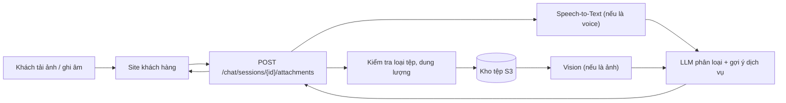

| Hạng mục | Giới hạn đề xuất |
| --- | --- |
| Ảnh | JPEG/PNG/WebP, tối đa 10 MB, tối đa 5 ảnh mỗi phiên |
| Ghi âm | m4a/mp3/webm, tối đa 60 giây |
| Thời gian phản hồi | < 10 giây, có hiển thị trạng thái đang xử lý (`NFR-PRF-02`) |
| Lưu trữ | Tệp lưu trên kho đối tượng, CSDL chỉ giữ đường dẫn |

### 10.4 Hai điểm chạm có rủi ro khả thi

⚠ `FR-AI-07` (tra cứu kỹ thuật) phụ thuộc `OQ-11`: **tài liệu quy trình sửa chữa, mã lỗi và thông số kỹ thuật có sẵn ở dạng số hay không**. Nếu tài liệu chỉ có bản giấy, chức năng này không khả thi trong phạm vi hiện tại. Thiết kế đã tách `SCR-A-31` và `POST /cms/ai/tech-assistant` thành một khối độc lập để có thể bỏ ra khỏi phạm vi mà không ảnh hưởng phần còn lại.

⚠ `FR-AI-09` (gợi ý kỳ bảo dưỡng) phụ thuộc `OQ-08`: **chu kỳ bảo dưỡng xác định theo số km, theo thời gian, hay theo loại xe**. Thiết kế hiện chừa sẵn bảng cấu hình chu kỳ theo loại xe và cột `odometer` trên `maintenance_histories` để dùng được cả hai cách tính khi có câu trả lời.

---

## 11. Thiết kế đa ngôn ngữ

| Hạng mục | Thiết kế | Căn cứ |
| --- | --- | --- |
| Ngôn ngữ hỗ trợ | `ja` (Nhật), `vi` (Việt), `en` (Anh) | `NFR-I18N-01` |
| Ngôn ngữ mặc định | ⚠ `ja` — **chưa được xác nhận** (`OQ-12`); `AS-02` cho rằng tiếng Nhật là mặc định | `OQ-12` |
| Chuyển ngôn ngữ | Nút trên thanh điều hướng của cả hai site, lưu vào `localStorage` và hồ sơ người dùng | `NFR-I18N-02` |
| Giao diện | `@nuxtjs/i18n`, tệp dịch tách theo màn hình | `NFR-I18N-01` |
| Email / SMS | `nestjs-i18n`, chọn theo `bookings.locale` — **không** theo ngôn ngữ của người thao tác | `NFR-I18N-04`, `FR-NTF-26` |
| Ngày giờ | Hiển thị theo định dạng của ngôn ngữ đang chọn, dữ liệu luôn là `Asia/Tokyo` | `NFR-I18N-03` |
| Dữ liệu nghiệp vụ đa ngữ | Tên dịch vụ và tên phụ tùng lưu dạng `jsonb`: `{"ja": "...", "vi": "...", "en": "..."}` | (thiết kế) |

**Điểm dễ sai:** ngôn ngữ của SMS/email phải lấy từ **ngôn ngữ khách đã chọn khi đặt lịch** (`bookings.locale`), không phải ngôn ngữ giao diện của nhân viên đang thao tác. Ví dụ Staff dùng CMS tiếng Nhật hủy một booking của khách người Việt thì `MSG-04` phải gửi bằng tiếng Việt.

⚠ `OQ-47` — chưa chốt việc **CMS có cần đủ 3 ngôn ngữ** hay không. Nhân viên cửa hàng ở Nhật nhiều khả năng chỉ dùng tiếng Nhật; làm đủ 3 ngôn ngữ cho CMS tốn thêm công dịch và bảo trì đáng kể. Thiết kế hiện chuẩn bị hạ tầng i18n cho cả hai site nhưng **chỉ cam kết đủ 3 ngôn ngữ cho site khách hàng**; CMS có thể chỉ làm `ja` ở giai đoạn đầu mà không phải sửa kiến trúc.

---

## 12. Thiết kế xử lý lỗi & nhật ký

### 12.1 Phân tầng xử lý lỗi

| Tầng | Cách xử lý |
| --- | --- |
| Giao diện | Bắt lỗi theo mã `ERR-xx`, hiển thị thông điệp đã dịch; lỗi mạng thì cho thử lại |
| API | `ExceptionFilter` toàn cục chuyển mọi ngoại lệ về định dạng thống nhất tại mục 6.2 |
| Nghiệp vụ | Ngoại lệ nghiệp vụ có mã riêng, không để lộ chi tiết kỹ thuật ra ngoài |
| Cơ sở dữ liệu | Vi phạm ràng buộc được ánh xạ sang mã `ERR-xx` tương ứng, không trả nguyên văn lỗi SQL |

### 12.2 Nguyên tắc viết thông điệp lỗi

Theo `NFR-UX-04`, thông điệp phải dùng ngôn ngữ đời thường:

| Không viết | Viết |
| --- | --- |
| "Constraint violation on bookings.slot" | "Khung giờ này vừa có người đặt mất. Xin quý khách chọn giờ khác." |
| "403 Forbidden" | "Lịch hẹn này đã được cửa hàng tiếp nhận nên không tự hủy được. Xin gọi cửa hàng theo số 053-xxx-xxxx." |
| "Validation failed: phone" | "Số điện thoại chưa đúng định dạng. Ví dụ: 090-1234-5678." |

### 12.3 Nhật ký hệ thống

| Loại | Nội dung ghi | Căn cứ |
| --- | --- | --- |
| Nhật ký thao tác Admin | Tạo/sửa/xóa danh mục, cập nhật thanh toán, đổi phân quyền — ghi vào `TBL-29 audit_logs` | `NFR-SEC-06` |
| Nhật ký trạng thái booking | Mọi lần chuyển trạng thái, kèm người thực hiện và thời điểm | `BR-19` |
| Nhật ký gửi thông báo | Thành công / thất bại của từng lần gửi SMS/email | `FR-NTF-06` |
| Nhật ký tồn kho | Mọi biến động số lượng kèm lý do | `FR-SHP-20` |
| Nhật ký ứng dụng | JSON có cấu trúc, gắn `requestId` xuyên suốt một yêu cầu | (thiết kế) |

**Không được ghi vào nhật ký:** mật khẩu, `access_token` của booking, nội dung đầy đủ của SMS. Số điện thoại ghi dạng che bớt.

---

## 13. Thiết kế đáp ứng yêu cầu phi chức năng

| NFR | Cách đáp ứng trong thiết kế |
| --- | --- |
| `NFR-PLT-01` Web only | Nuxt 3 chạy trên trình duyệt, không có mã native |
| `NFR-PLT-02` `NFR-PLT-07` Mobile-first | Site khách hàng dựng từ điểm ngắt 375 px lên; CSS viết theo hướng `min-width` |
| `NFR-PLT-03` Trình duyệt | Mục tiêu build: 2 phiên bản gần nhất của Chrome, Edge, Safari, Firefox ⚠ `OQ-49` chưa chốt phiên bản tối thiểu của iOS Safari / Android Chrome |
| `NFR-PLT-04` `NFR-PLT-05` Hai site | Hai ứng dụng Nuxt, hai tên miền, chung một API (mục 2.4, 2.5) |
| `NFR-PLT-06` Quét QR trên di động | `SCR-A-08` dùng `getUserMedia`, bố cục responsive riêng cho CMS |
| `NFR-PLT-08` Đủ chức năng trên SP | Mọi màn hình `SCR-C-*` đều có bản SP; không có chức năng chỉ chạy ở bản PC (`AC-34`) |
| `NFR-I18N-01`…`04` | Xem chương 11 |
| `NFR-UX-01` `NFR-UX-02` Dễ dùng cho người lớn tuổi | Cỡ chữ gốc 16 px trở lên, tương phản đạt WCAG AA, vùng bấm ≥ 44 px |
| `NFR-UX-03` Tối đa 3–4 bước | Luồng đặt lịch đúng 4 màn hình `SCR-C-13`…`16` |
| `NFR-UX-05` Không cuộn ngang | Bảng dữ liệu trên SP chuyển sang dạng thẻ (`NFR-UX-08`); phần tử rộng bọc trong vùng cuộn riêng |
| `NFR-UX-07` Hạn chế gõ phím | Bộ chọn ngày giờ, danh sách chọn sẵn, `inputmode` phù hợp từng trường |
| `NFR-SEC-01` HTTPS | Bắt buộc ở CDN/reverse proxy, bật HSTS |
| `NFR-SEC-02` Băm mật khẩu | `argon2id` |
| `NFR-SEC-03` Kiểm quyền phía máy chủ | Hai lớp guard, mục 7.2 |
| `NFR-SEC-05` QR không chứa thông tin cá nhân | Mã QR chỉ chứa chuỗi ngẫu nhiên `qr_code`, tra ngược qua CSDL |
| `NFR-SEC-07` `09` `10` Token tra cứu | 32 byte ngẫu nhiên, `noindex`, che bớt thông tin — mục 7.1 |
| `NFR-SEC-08` Chống lạm dụng | Giới hạn tần suất + CAPTCHA theo ngưỡng — mục 7.4 |
| `NFR-PRF-01` Phản hồi < 3 giây | SSR có bộ nhớ đệm cho trang công khai; chỉ mục CSDL theo mục 5.3 |
| `NFR-PRF-02` AI < 10 giây | Gọi AI bất đồng bộ, hiển thị trạng thái đang xử lý, có thời gian chờ tối đa |
| `NFR-PRF-04` Sao lưu | `BAT-09` |
| `NFR-PRF-05` Mở rộng thêm cửa hàng | Cửa hàng là dữ liệu, không phải cấu hình mã nguồn; thêm cửa hàng chỉ là thêm bản ghi `TBL-01` |

---

## 14. Quyết định thiết kế

| ID | Quyết định | Lý do | Phương án đã cân nhắc |
| --- | --- | --- | --- |
| `TKD-01` | **Hai ứng dụng Nuxt trong một repo**, dùng chung layer | Đáp ứng `NFR-PLT-04`…`07` mà vẫn dùng lại được component và kiểu dữ liệu | Một ứng dụng chia route — bị loại vì hai site cần chiến lược render và điểm ngắt khác nhau |
| `TKD-02` | **Tách tên miền** giữa site khách hàng và CMS | Cookie phiên CMS không bị gửi kèm từ site khách hàng; thỏa `NFR-PLT-05` triệt để | Chung tên miền, phân biệt bằng đường dẫn `/cms` |
| `TKD-03` | ⚠ **PostgreSQL** làm CSDL | Hỗ trợ `jsonb` cho dữ liệu đa ngữ và `vehicle_snapshot`, `timestamptz` chuẩn, ràng buộc mạnh | MySQL — cần khách hàng xác nhận, yêu cầu không chỉ định |
| `TKD-04` | **Redis** cho hàng đợi thông báo và khóa batch | Thông báo phải thử lại được; batch không được chạy trùng khi triển khai nhiều bản sao | Gửi đồng bộ ngay trong request — bị loại vì lỗi SMS gateway sẽ làm hỏng cả giao dịch đặt lịch |
| `TKD-05` | **Kho đối tượng S3** cho ảnh, voice, PDF | Tệp chatbox có thể lớn; không nên lưu trong CSDL | Lưu blob trong CSDL |
| `TKD-06` | **Monolith có mô-đun** thay vì microservice | Quy mô một chuỗi cửa hàng; giảm chi phí vận hành, vẫn tách được sau | Microservice ngay từ đầu |
| `TKD-07` | **Kiểm tra năng lực khung giờ trong cùng giao dịch tạo booking**, có khóa | Chống hai khách cùng đặt vào chỗ cuối cùng | Chỉ kiểm tra ở bước hiển thị lịch — không an toàn |
| `TKD-08` | **Quét QR là thao tác idempotent** qua `UPDATE ... WHERE status = 'CONFIRMED'` | `FR-QRC-08` yêu cầu quét lại không sinh thêm lần chuyển trạng thái | Kiểm tra rồi cập nhật thành hai bước — có khe hở tranh chấp |
| `TKD-09` | **Cột `overdue_notified_at`** thay vì bảng đánh dấu riêng | Bảo đảm `FR-NTF-21`, `FR-NTF-24` và cho phép quét bù (`FR-NTF-22`) bằng một điều kiện duy nhất | Lọc theo ngày chạy — không quét bù được khi lỡ một lần chạy |
| `TKD-10` | **Cờ `is_waiting_for_part` là cột boolean**, không phải văn bản | `BR-45`, `DEC-22` — mọi xử lý tự động căn cứ vào cờ này | Đánh dấu bằng ghi chú nội bộ |
| `TKD-11` | **`ShopScopeGuard` tự thêm điều kiện lọc vào truy vấn** thay vì kiểm tra sau khi lấy dữ liệu | `FR-SHP-36` — lọc phải nằm ở máy chủ và không thể bị quên ở từng API | Kiểm tra thủ công trong từng service — dễ sót |
| `TKD-12` | **Xóa mềm** cho dữ liệu nghiệp vụ chính | `FR-BKG-13a` — link tra cứu không hết hạn, dữ liệu phải còn để tra lại | Xóa cứng |
| `TKD-13` | **Bảng giá không gắn cửa hàng**, `services` không có cột thời lượng | `BR-32`, `BR-41` — nếu thêm hai cột này thì sai lệch với `DEC-14` và `DEC-25` | (không có) |
| `TKD-14` | **WebSocket có dự phòng polling** cho thông báo CMS | `FR-NTF-16` yêu cầu hiện ngay không tải lại; polling bảo đảm không mất thông báo khi rớt kết nối | Chỉ polling 30 giây ⚠ `OQ-23` |
| `TKD-15` | **Kết quả AI không ghi thẳng vào bảng nghiệp vụ** | `FR-AI-10` — mọi gợi ý phải qua xác nhận của người | Ghi thẳng rồi cho sửa sau |

---

## 15. Truy vết yêu cầu → thiết kế

| Nhóm yêu cầu | Số FR | Màn hình | API | Bảng | Luồng / Batch |
| --- | :---: | --- | --- | --- | --- |
| `FR-AUT` Xác thực | 9 | `SCR-C-06`…`10`, `SCR-A-01` | API-AUT | `TBL-05`, `TBL-06`, `TBL-04` | — |
| `FR-VEH` Phương tiện | 6 | `SCR-C-11`, `SCR-C-12`, `SCR-C-24` | API-VEH | `TBL-07`, `TBL-21` | — |
| `FR-SRV` Dịch vụ & giá | 7 | `SCR-C-02`, `SCR-C-03`, `SCR-A-16` | API-CAT, API-CMS-MST | `TBL-13`, `TBL-14` | — |
| `FR-BKG` Đặt lịch | 37 | `SCR-C-13`…`23`, `SCR-A-03`…`07` | API-BKG, API-CMS-BKG | `TBL-08`…`TBL-12`, `TBL-26` | SEQ-01, 02, 04, 06; BAT-04, 07, 08 |
| `FR-QRC` Mã QR | 12 | `SCR-C-21`, `SCR-A-08`…`10` | API-CMS-QRC | `TBL-08` (`qr_code`) | SEQ-02, SEQ-03 |
| `FR-RPR` Sửa chữa & báo giá | 4 | `SCR-C-27`, `SCR-C-28`, `SCR-A-11`, `SCR-A-12` | API-CMS-RPR | `TBL-19`, `TBL-20`, `TBL-21` | SEQ-08 |
| `FR-PRT` Phụ tùng | 4 | `SCR-A-17`, `SCR-A-18` | API-CMS-MST | `TBL-15` | — |
| `FR-SHP` Nhiều cửa hàng | 42 | `SCR-A-19`…`27`, `SCR-C-04`, `SCR-C-05`, `SCR-C-14` | API-CMS-INV, API-CMS-SHP | `TBL-01`…`TBL-03`, `TBL-16`…`TBL-18` | SEQ-05, SEQ-06; BAT-05, BAT-06 |
| `FR-PAY` Thanh toán | 4 | `SCR-A-13`, `SCR-A-14` | API-CMS-PAY | `TBL-22`, `TBL-23` | SEQ-08 |
| `FR-NTF` Thông báo | 26 | `SCR-A-15` | API-CMS-NTF, WS | `TBL-24`, `TBL-25` | SEQ-07; BAT-01, 02, 03 |
| `FR-RPT` Báo cáo | 7 | `SCR-A-30` | API-CMS-RPT | (truy vấn tổng hợp) | — |
| `FR-AI` Trí tuệ nhân tạo | 10 | `SCR-C-26`, `SCR-A-18`, `SCR-A-31` | API-AI, API-CMS-RPR | `TBL-27`, `TBL-28` | BAT-03 |
| `FR-ADM` Quản trị | 7 | `SCR-A-24`, `SCR-A-28`, `SCR-A-29`, `SCR-A-32` | API-CMS-MST | `TBL-04`, `TBL-12` | — |
| **Tổng** | **175** | **60 màn hình** | **13 nhóm API** | **29 bảng** | **8 luồng, 9 batch** |

### 15.1 Đối chiếu tiêu chí nghiệm thu

| Nhóm AC | Thành phần thiết kế chịu trách nhiệm |
| --- | --- |
| `AC-01`…`AC-02p` Đặt lịch, Guest, link token | `SEQ-01`, `SCR-C-13`…`20`, `TBL-08.access_token` |
| `AC-03`…`AC-04c` Mã QR, tiếp nhận xe | `SEQ-02`, `SEQ-03`, `TKD-08` |
| `AC-05`…`AC-11` Báo giá, thanh toán, báo cáo, đa ngôn ngữ | `SEQ-08`, `SCR-A-11`…`14`, `SCR-A-30`, chương 11 |
| `AC-12`…`AC-21` Nhiều cửa hàng, tồn kho, điều phối | `SEQ-05`, `SEQ-06`, `TBL-16`…`TBL-18` |
| `AC-22`…`AC-23` Booking chờ phụ tùng đổi ngày hẹn | `TKD-10`, `BAT-08`, `FR-BKG-31` |
| `AC-24`…`AC-30` Giờ làm việc, năng lực, cô lập dữ liệu, QR | `TBL-02`, `TBL-03`, `TKD-11`, `BR-44` |
| `AC-31`…`AC-33` Phân vai Admin / Staff | Chương 7, `ShopScopeGuard` |
| `AC-34`, `AC-35` Toàn bộ luồng khách trên SP, 375 px | Mục 3.5, `NFR-PLT-08` |

---

## 16. Điểm tồn đọng ảnh hưởng thiết kế

Bảng dưới liệt kê các `OQ` của `RD-2026-001` **có tác động tới thiết kế**, kèm phương án tạm thời đã áp dụng để không chặn tiến độ. Khi khách hàng trả lời, cần rà lại đúng những phần được nêu ở cột cuối.

| OQ | Mức | Thiết kế tạm thời đang áp dụng | Cần sửa lại ở đâu nếu câu trả lời khác |
| --- | --- | --- | --- |
| `OQ-04` Nhà cung cấp Email/SMS | Trung bình | Trừu tượng hóa qua giao diện `NotificationProvider`, chưa gắn nhà cung cấp cụ thể | Chỉ tầng adapter, không ảnh hưởng nghiệp vụ |
| `OQ-05` Quyền **xóa** của Staff | Thấp | **Không cấp quyền xóa** — Staff chỉ tạo và sửa *(phần báo cáo đã chốt tại `DEC-28`)* | Mục 7.3 |
| `OQ-06` Thời hạn lưu dữ liệu cá nhân | Trung bình | Chưa có tiến trình xóa định kỳ | Bổ sung `BAT-10`, mục 5.5 |
| `OQ-08` Cách xác định chu kỳ bảo dưỡng | Trung bình | Chừa sẵn bảng chu kỳ theo loại xe **và** cột `odometer` | `BAT-03`, `FR-AI-09`, `TBL-21` |
| `OQ-10` Hóa đơn theo ngày | Trung bình | Mỗi booking một hóa đơn, cho xuất hàng loạt theo ngày | `SCR-A-14`, `TBL-22` |
| `OQ-11` Tài liệu kỹ thuật dạng số | **Cao** | `SCR-A-31` và `POST /cms/ai/tech-assistant` tách thành khối độc lập, bỏ được khỏi phạm vi | Chương 10, `FR-AI-07` |
| `OQ-12` Ngôn ngữ mặc định | Thấp | Mặc định `ja` | Chương 11 |
| `OQ-14` OTP cho Guest | **Cao** | Chưa bật OTP; đã chừa `POST /auth/otp/*` và cột `phone_verified_at` | Mục 7.4, `SEQ-01` |
| `OQ-15` Gửi hóa đơn khi khách không có email | Trung bình | Chỉ bản in tại cửa hàng | `SCR-A-14`, `MSG` |
| `OQ-16` Gom booking cũ khi Guest đăng ký | Trung bình | Chưa tự gom — cần xác thực OTP trước khi gom | `FR-VEH-06`, `TBL-05` |
| `OQ-20` Ngưỡng booking bị bỏ quên | Trung bình | `BAT-07` đặt tạm **4 giờ làm việc**, đưa vào bảng cấu hình | Chương 9 |
| `OQ-21` Hóa đơn khi hủy booking đã tiến hành | Trung bình | Giữ nguyên hóa đơn đã lập, đánh dấu hủy; không tự hoàn tiền | `SEQ-08`, `TBL-22` |
| `OQ-23` Realtime hay polling; có âm thanh không | Trung bình | WebSocket + dự phòng polling 30 giây; âm thanh mặc định tắt | `TKD-14`, mục 8.4 |
| `OQ-24` Sự kiện nào cần báo vào CMS | Trung bình | Có thêm **đổi lịch**; chatbox **không** sinh thông báo | Mục 8.1 |
| `OQ-28` Danh mục lý do hủy | Thấp | Dùng 5 mục đề xuất trong `RD`, quản lý được ở `SCR-A-32` | `TBL-12` |
| `OQ-29` URL trong SMS nhắc đặt lại | Trung bình | Form đặt lịch **điền sẵn** `/booking?from={bookingId}` | `MSG-06` |
| `OQ-30` Batch 16:00 có chạy ngày nghỉ không | Thấp | Vẫn chạy; SMS vẫn gửi, thông báo CMS chờ ngày làm việc kế tiếp | `BAT-01`, `SEQ-07` |
| `OQ-31` Một hay hai mẫu SMS quá hạn | Trung bình | Dùng chung một mẫu `MSG-06` | Mục 8.2 |
| `OQ-34` Tồn kho có gồm đặt hàng nhà cung cấp | **Cao** | **Ngoài phạm vi** — chỉ theo dõi số lượng và điều phối nội bộ | Chương 5, chương 6 — ảnh hưởng phạm vi dự án |
| `OQ-35` Khách tự đổi cửa hàng | Trung bình | Chỉ nhân viên chuyển được (`BR-28`) | `SEQ-06`, API-CMS-BKG |
| `OQ-36` Gợi ý cửa hàng gần nhất | Thấp | Chỉ hiện danh sách để khách tự chọn | `SCR-C-14` |
| `OQ-39` Lịch sử thay đổi giá | Trung bình | Chưa có bảng lịch sử giá; booking lấy giá tại thời điểm lập báo giá | `TBL-14`, `TBL-20` |
| `OQ-41` Khoảng dự phòng cảnh báo phụ tùng | Thấp | `BAT-06` đặt tạm **3 ngày**, đưa vào bảng cấu hình | Chương 9 |
| `OQ-44` Cửa hàng cũ có xem được lịch sử không | Trung bình | Mất quyền hoàn toàn sau khi chuyển | Mục 7.2 |
| `OQ-46` QR khi đổi lịch | Thấp | **Giữ nguyên** mã QR cũ — mã gắn với booking, không gắn với ngày hẹn | `TBL-08.qr_code`, `SEQ-02` |
| `OQ-47` CMS có cần đủ 3 ngôn ngữ | Trung bình | Hạ tầng i18n có sẵn cho cả hai site, chỉ cam kết 3 ngôn ngữ cho site khách hàng | Chương 11 |
| `OQ-48` Site khách hàng có cần PWA | Trung bình | **Không** làm PWA; khách truy cập qua trình duyệt | Chương 2, `NFR-PLT-01` |
| `OQ-49` Danh sách thiết bị/trình duyệt phải bảo đảm | Thấp | Điểm ngắt nhỏ nhất 375 px, 2 phiên bản gần nhất của các trình duyệt chính | Mục 3.5, chương 13 |

**Ba điểm mức Cao (`OQ-11`, `OQ-14`, `OQ-34`) nên được chốt trước khi bước sang thiết kế chi tiết**, vì chúng ảnh hưởng tới phạm vi chứ không chỉ tới cách làm.

---

## 17. Lịch sử phiên bản

| Phiên bản | Ngày | Người lập | Nội dung |
| --- | --- | --- | --- |
| 1.1 | 2026-08-25 | Đội phát triển | Cập nhật theo `DEC-28`: **báo cáo chỉ Admin** (`SCR-A-30`, ma trận API mục 7.3), **thanh toán cả Admin và Staff**. Thu hẹp `OQ-05` tại chương 16 |
| 1.0 | 2026-08-25 | Đội phát triển | Bản đầu tiên. Dựng từ `RD-2026-001` v1.16, *Thu thập yêu cầu ban đầu.docx* và *Proposal.pptx*. Gồm kiến trúc hai site, 60 màn hình, 8 luồng nghiệp vụ, 29 bảng dữ liệu, 13 nhóm API, 9 tiến trình batch, 15 quyết định thiết kế và bảng truy vết đầy đủ 175 yêu cầu chức năng |
